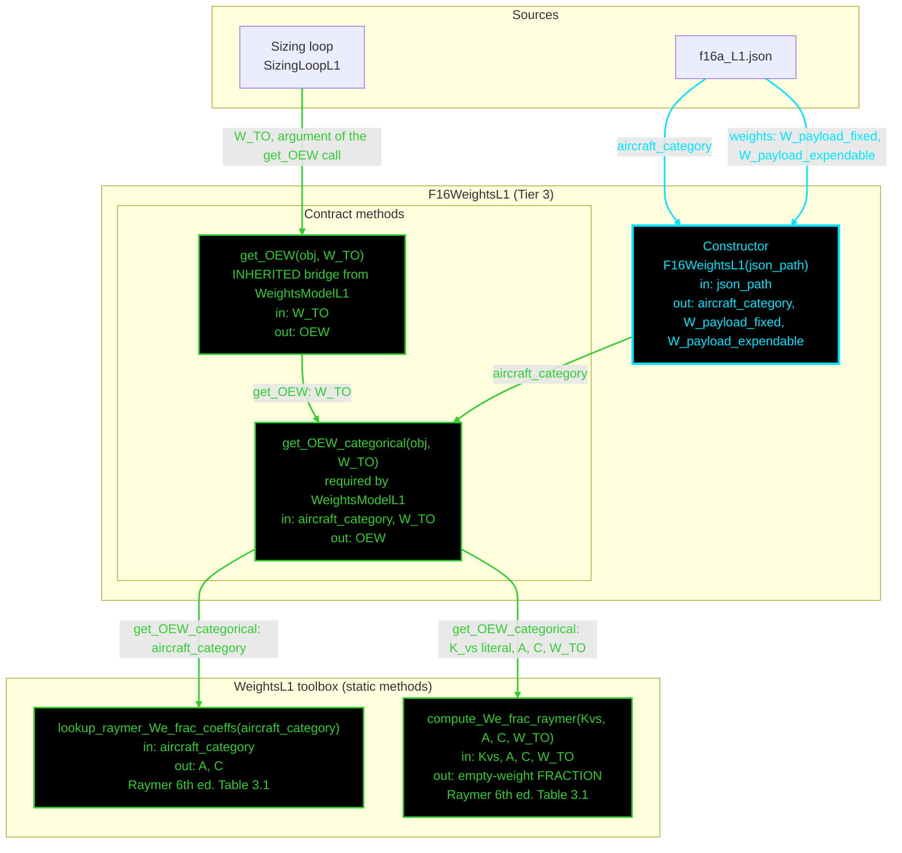

# F16WeightsL1: input-to-output data flow

This chart shows the data path for `F16WeightsL1`, the Level 1 (L1) weights
class. L1 is a statistical empty-weight fraction: a power law in `W_TO`
selected by aircraft category.

L1 is the only weights level with NO dependency injection. The regression takes
just `W_TO` and `aircraft_category`, so there is no design Mach, no cruise
condition, no geometry object and no propulsion object to inject.

## Viewing this chart with pan and zoom

Mermaid inside a `.md` renders at a fixed size, so a wide chart is hard to read
in a plain preview. Open `docs/Mermaid_Diagrams/viewer.html` and drag this file
onto it. Wheel or pinch zooms, drag pans, and `f` fits.

The viewer reads the first mermaid fenced block straight out of this file, so
there is no second copy of the diagram to keep in step.

**Read this first.**
- The chart runs TOP TO BOTTOM. The class is small, so the vertical form reads
  better.
- One function per node. Name, inputs, output, citation. Returned values and
  coefficients live in the notes table, not in the labels.
- No grouped "Inputs" node. Every value rides the arrow that carries it. A
  source node holds only a file or object name.
- **Colour says what kind of member a node is; dash says whether the value was
  worked on.** A box whose body reads a stored field and returns it is a pure
  relay, so it is dashed, and so is every line leaving it. A box that evaluates
  an equation, reads a table, or combines its inputs is solid.
- **A line's colour comes from the node it POINTS AT; its dash comes from the
  node it LEAVES.** A file source node is not a method, so it takes the dash of
  the constructor it feeds.
- Constructor cyan. Every other function green. An INJECTOR, meaning any
  `get.<name>` property getter, is magenta, and magenta beats every other node
  colour.
- **THERE ARE NO INJECTORS HERE.** `F16WeightsL1` declares zero `Dependent`
  properties, so the chart has no magenta node. That is the correct answer, not
  an oversight: `get_OEW` and `get_OEW_categorical` both take `W_TO` as an
  ARGUMENT, so they recompute per call and cannot go stale. The
  inputs-versus-dependent rule governs stored derived state, and L1 stores none.
- There are NO yellow nodes and NO red nodes. Every static drawn is reached, and
  no non-injector function here calls nothing.
- THE THREE CLASS METHODS ARE NOW ONE. The first pass drew `OEW`,
  `compute_We_fraction` and `compute_We_roskam` side by side at class level,
  because `WeightsBase` and `WeightsModelL1` named the same quantities twice.
  `WeightsModelL1` now supplies a concrete `get_OEW` bridge, so the concrete
  class writes the categorical form ONLY.
- `W_TO` therefore arrives ONCE, not three times. There is a single public entry
  point, and it takes `W_TO` as a call argument. The class never reads
  `obj.W_TO`, which is exactly what stops the value going stale.
- The `W_TO` property still exists, to satisfy the `WeightsBase` contract, and
  it is `NaN` until the loop sets it. No method here reads it.
- `K_vs` IS NOT TABULATED. It is a design value, not a Table 3.1 constant, so
  `lookup_raymer_We_frac_coeffs` returns only `A` and `C`. The F-16A is
  fixed-sweep, so `get_OEW_categorical` passes 1.00 as a literal.
- The two regressions are NOT interchangeable, and this class uses ONE of them.
  Raymer's power law is the central estimate and is what `get_OEW` returns.
  Roskam's Eq. 2.16 is a LOWER BOUND on empty weight: an actual OEW should
  exceed it, and it must never be summed into an OEW or reported as one. No
  F-16A class reaches it.

## Field-by-field notes

| Class member | Source | Notes |
| --- | --- | --- |
| `aircraft_category` | `f16a_L1.json`, top-level field | `jet_fighter`. One canonical flag. Selects the Raymer Table 3.1 row. It also names the Roskam Table 2.15 row, but this class no longer reaches that lookup. |
| `W_TO` | Sizing loop, mutated in place | `NaN` until the loop sets it. A `WeightsBase` abstract property. |
| `W_energy` | Mission analysis, mutated in place | `NaN` until set. Was previously 6296.3, which is Brandt Wt!B6, a live formula `= B3 - B4 - B5 - B12`, so `W_TO` minus payload minus OEW: a back-calculated Brandt OUTPUT. Deleted from the JSON in Phase 3, because CLAUDE.md forbids using an output as an input. |
| `W_payload_expendable` | `.weights.W_payload_expendable` | 4400 lbf, Brandt Wt!B5. |
| `W_payload_fixed` | `.weights.W_payload_fixed` | 700 lbf, Brandt Wt!B4. |
| Both payload values | | INERT. No `WeightsL1` static reads either one. They satisfy the `WeightsBase` closure contract and are consumed by the sizing loop, which sums them and hands the total to `SizingSteps.togw_update`. They make the closure identity work out: 31377 - 19980.70 - 6296.30 = 5100 = 700 + 4400. |
| `A`, `C` | `lookup_raymer_We_frac_coeffs` | 2.34 and -0.13 for `jet_fighter`, Raymer Table 3.1 via `metabook_data.md:22`. |
| `K_vs` | Literal in `get_OEW_categorical` | 1.00, fixed sweep. NOT returned by the lookup: `K_vs` is a design value, not a table constant. 1.04 would be variable sweep, `metabook_data.md:20-22`. |
| `get_OEW` at `W_TO` = 31,377 lbf | Computed | Fraction 0.609055, so OEW = 19,110.31 lbf. |
| L1 sizing closure | Computed | `W_TO` 26,762.1 lbf and OEW 16,640.2 lbf, 12 iterations. |
| Ground truth, for context only | | Brandt Wt!B12 = 19,980.70 lbf, so -4.36 percent. Casey's `corrections.xls` = 19,148.08 lbf, so -0.20 percent. Two distinct provenances about 4.3 percent apart. The class header records that an earlier version cited the wrong cell in the wrong workbook. |

## Methods with no upstream call at L1

Two of the four `WeightsL1` statics are not reached from inside this class, so
neither appears in the chart: they carry no arrow out of `F16WeightsL1`. Both
are live and correct, so neither earns a red node.

| Static | Reached by |
| --- | --- |
| `lookup_We_roskam_coeffs(aircraft_category)` | `Aero481WeightsL1`, and `weights_brandt_comparison` for the bound row |
| `compute_We_roskam(A, B, W_TO)` | the same two |

Together they give the Roskam Part I Eq. 2.16 log-log minimum empty weight,
`jet_fighter` `A` = 0.5091 and `B` = 0.9505, which is 15,673.73 lbf at
`W_TO` = 31,377. Roskam presents it as a bound, so no F-16A class uses it as an
OEW.

`compute_We_frac_raymer` is also reached from outside this class:
`Aero481WeightsL1` calls it with Sainristil coefficients rather than Raymer's,
because the equation is the bare `Kvs * A * W^C` power law and the name records
only where the F-16A's coefficients come from.

## Source files

| Item | File |
| --- | --- |
| Concrete class | `examples/F16A/models/disciplines/weights/F16WeightsL1.m` |
| Tier 2, abstract | `src/disciplines/weights/WeightsModelL1.m` |
| Tier 1, base | `src/base/WeightsBase.m` |
| Toolbox | `src/disciplines/weights/WeightsL1.m` |
| Input JSON | `examples/F16A/inputs/f16a_L1.json` |
