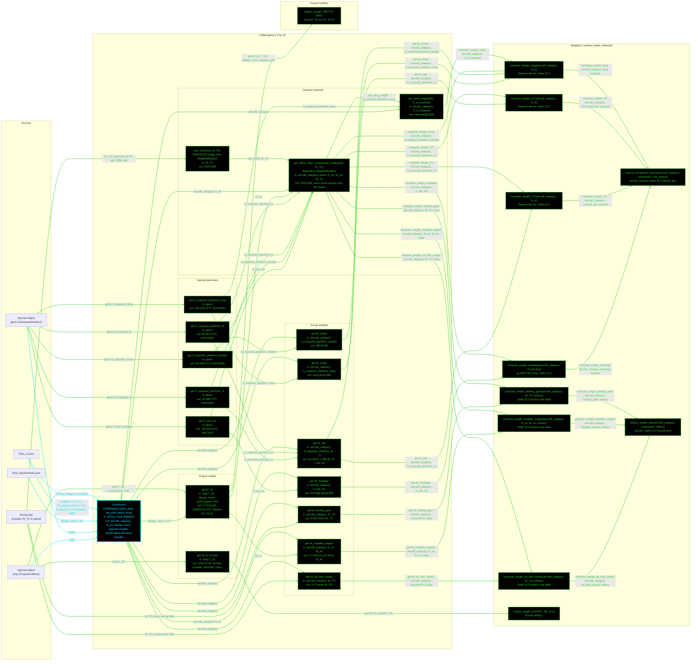

# F16WeightsL2: input-to-output data flow

This chart shows the data path for `F16WeightsL2`, the Level 2 (L2) weights
class. L2 is an area-based group buildup: Raymer Table 15.2 surface densities
on the exposed and wetted areas, plus the Table 15.2 fraction sub-tables for
the landing gear, the installed engine and the all-else-empty group.

L2 reads TWO JSON files and takes TWO injected objects. It stores no geometry
number and no engine number.

**Read this first.**
- The chart runs LEFT TO RIGHT.
- EVERY arrow carries a label naming the exact value it moves.
- There is no "Inputs" block. The constructor's outgoing arrows carry the field
  names.
- The constructor is cyan. Every other function is green.
- Every edge takes the color of the node it POINTS AT.
- THERE ARE NO RED NODES. Every live static is reached. The five getters that
  still named deleted statics were repointed on 2026-09-02, so reading a
  property and calling `get_OEW` now give the same number: the getter sum and
  `get_OEW(31377)` agree at 15844.648310 exactly.
- THE OBJECT-TAKING WRAPPERS ARE GONE. The first pass drew seven of them
  (`OEW`, `weight_wing`, `weight_tail`, `weight_fuselage`,
  `weight_landing_gear`, `weight_installed_engine`, `weight_all_else_empty`),
  each taking `obj`. Every live static now takes explicit scalars, so the
  buildup passes `aircraft_category` and an area or a `W_TO`.
- `OEW` IS NO LONGER AN OVERRIDE. `WeightsModelL2` supplies a concrete
  `get_OEW` bridge onto `get_OEW_major_component_buildup`, which sums the seven
  groups plus the strake itself. There is no toolbox `OEW` static to call.
- EVERY GEOMETRIC VALUE IS INJECTED. The five area getters read `geom`, and the
  `.weights` block now holds only `N_en` and the two payloads.
- `design_mach` comes from the REQUIREMENTS file, not the spec file. It says
  what the aircraft must do, not what it is.
- `W_TO` enters from the sizing loop, not the JSON. Two getters demand a
  non-`NaN` value and error otherwise.
- The strake takes the WING density, 9.0 psf on the exposed strake area, so it
  reads 180.00 lbf. Brandt's own coefficient is 4.5 psf, giving 90.00. That is
  a deliberate model choice and the one term that puts L2 off the 2026-08-18
  baseline.
- `W_en` and `W_en_brandt` are NOT alternatives to pick between. `W_en` is the
  official uninstalled engine weight and is the only one that enters the
  buildup. `W_en_brandt` is already installed, and it is for the comparison
  report only.
- The private `requireWTO` guard is not drawn, to match the geometry charts.
  The two getters that use it take their `W_TO` arrow straight from the loop.

## Field-by-field notes

| Class member | Source | Notes |
| --- | --- | --- |
| `aircraft_category` | `f16a_L2.json`, top-level field | `jet_fighter`. Selects the Table 15.2 density column and the fraction column. |
| `N_en` | `.weights.N_en` | 1, T.O. 1F-16A-1 Sec. I. Still a weights input because no propulsion class exposes an engine count. |
| `design_mach` | `f16a_requirements.json` | 2.0. Feeds Raymer Eq. 10.10 only. |
| `W_payload_fixed` | `.weights.W_payload_fixed` | 700 lbf, Brandt Wt!B4. |
| `W_payload_expendable` | `.weights.W_payload_expendable` | 4400 lbf, Brandt Wt!B5. |
| `W_TO` | Sizing loop, mutated in place | `NaN` until the loop sets it. `get.W_landing_gear` and `get.W_all_else_empty` route through the private `requireWTO`, which errors on `NaN`. |
| `S_exposed_planform_wing` | `geom.S_exposed_wing` | 196.2261 ft^2, EXPOSED. |
| `S_exposed_planform_ht` | `geom.S_exposed_ht` | 49.8473 ft^2, EXPOSED. NOT `geom.S_ht` = 108, which is the FULL reference. |
| `S_exposed_planform_vt` | `geom.S_exposed_vt` | 40.8897 ft^2, EXPOSED. NOT `geom.S_vt` = 60. |
| `S_exposed_planform_strakes` | `geom.S_exposed_strake` | 20.0000 ft^2. A body surface, so the fuselage does not clip it and exposed equals the reference area. |
| `S_wet_fus` | `geom.S_wet_fuselage` | 730.3023 ft^2. A WETTED area: the Table 15.2 fuselage row takes wetted, not planform. |
| `S_strake`, `k_strake` | Removed 2026-09-02 | Were weights inputs holding 20.0 and 4.5. The area is a geometric value, so it moved to `f16a_L2.json` `.geometry.strake`. The density is no longer used, because the strake takes the wing density. |
| `W_en` | `PropL2.engine_weight_AB` | 2775.0210 lbf, UNINSTALLED. The 1.3 installed factor is applied separately by `compute_weight_installed_engine`. |
| `W_en_brandt` | `WeightsL2.engine_weight_brandt` | 4730.2300 lbf, already installed, so no 1.3. Comparison report only, never summed. |
| Group weights at `W_TO` = 31,377 | Computed | Wing 1766.03, HT 199.39, VT 216.72, fuselage 3505.45, gear 1035.44, installed engine 3607.53, all-else 5334.09, strake 180.00. |
| `get_OEW` at `W_TO` = 31,377 | Computed | 15,844.65 lbf. |
| L2 sizing closure | Computed | `W_TO` 23,279.4 lbf, `S_ref` 175.0151 ft^2, `T_SL` 20,112.5 lbf, OEW 12,322.0 lbf, `W_fuel` 5857.4 lbf, 14 iterations. |
| Strake basis | Model choice | The wing density gives 180.00 lbf. Brandt's Wt!H7 coefficient of 4.5 psf gives 90.00. The 90 lbf difference is the only term putting L2 off the 2026-08-18 baseline, where `W_TO` closes at 23,087.2 lbf. |

## Methods with no upstream call at L2

Two `WeightsL2` statics are not reached from inside this class, so neither
appears in the chart: they carry no arrow out of `F16WeightsL2`. Both are live
and correct.

| Static | Reached by |
| --- | --- |
| `jet_engine_weight_roskam(T0_lbf)` | `Aero481WeightsL1` engine delta, and `B777WeightsL2.get.W_en`, across the injection boundary |
| `turboprop_engine_weight_roskam(P_shp)` | Nothing. No example aircraft is a turboprop. |

## Source files

| Item | File |
| --- | --- |
| Concrete class | `examples/F16A/models/disciplines/weights/F16WeightsL2.m` |
| Tier 2, abstract | `src/disciplines/weights/WeightsModelL2.m` |
| Tier 1, base | `src/base/WeightsBase.m` |
| Toolbox | `src/disciplines/weights/WeightsL2.m` |
| Engine weight | `src/disciplines/propulsion/PropL2.m` |
| Input JSON | `examples/F16A/inputs/f16a_L2.json` |
| Requirements JSON | `examples/F16A/inputs/f16a_requirements.json` |
