# F16WeightsL2: input-to-output data flow

This chart shows the data path for `F16WeightsL2`, the Level 2 (L2) weights
class. L2 is an area-based group buildup: Raymer Table 15.2 surface densities on
the exposed and wetted areas, plus the Table 15.2 fraction sub-tables for the
landing gear, the installed engine and the all-else-empty group.

L2 reads TWO JSON files and takes TWO injected objects. It stores no geometry
number of its own: all four areas arrive through `Dependent` getters.

## Viewing this chart with pan and zoom

Mermaid inside a `.md` renders at a fixed size, so a wide chart is hard to read
in a plain preview. Open `docs/Mermaid_Diagrams/viewer.html` and drag this file
onto it. Wheel or pinch zooms, drag pans, and `f` fits.

The viewer reads the first mermaid fenced block straight out of this file, so
there is no second copy of the diagram to keep in step.

**Read this first.** Same rule set as the L1 chart, with the L2-specific notes at
the end of the list:
- The chart runs LEFT TO RIGHT.
- One function per node. Name, inputs, output, citation. Returned values and
  coefficients live in the notes tables, not in the labels.
- No grouped "Inputs" node. Every value rides the arrow that carries it. A
  source node holds only a file or object name.
- **Colour says what kind of member a node is; dash says whether the value was
  worked on.** A box whose body reads a stored field and returns it is a pure
  relay, so it is dashed, and so is every line leaving it. A box that evaluates
  an equation, reads a table, or combines its inputs is solid.
- **A line's colour comes from the node it POINTS AT; its dash comes from the
  node it LEAVES.** A file source node is not a method, so it takes the dash of
  the constructor it feeds.
- **Constructor cyan. Every other function green. An INJECTOR, meaning any
  `get.<name>` property getter, is MAGENTA**, so a derived read is identifiable
  at a glance. Magenta beats every other node colour, and an injector is EXEMPT
  from the `no toolbox call` marker, because for a getter that is the normal
  case.
- ALL FOURTEEN INJECTORS ARE DRAWN, one node each. Five are dashed: the four
  exposed areas and the wetted fuselage area come out of `geom` exactly as they
  went in. The other nine are solid, because each evaluates a Table 15.2 density
  or fraction, or calls Raymer Eq. 10.10.
- There are NO yellow nodes and NO red nodes. Every `WeightsL2` static is
  reached, and no non-injector function here calls nothing.
- THE FOUR AREA GETTERS CARRY AN `S_exposed_planform_` PREFIX, and the values
  behind them are EXPOSED, not full, planforms. Wiring `geom.S_ht` = 108 in
  place of `geom.S_exposed_ht` is silent: no error, a plausible wrong number.
- THE FUSELAGE TAKES WETTED AREA while the three lifting surfaces take exposed
  planform. That asymmetry is Raymer Table 15.2's own, not a slip.
- `get_OEW` IS NOT WRITTEN HERE. `WeightsModelL2` supplies the concrete bridge,
  so the concrete class writes `get_OEW_major_component_buildup` only.
- THE BUILDUP AND THE GETTERS BOTH REACH THE TOOLBOX, and that is deliberate.
  `get_OEW_major_component_buildup(W_TO)` evaluates the two fraction terms at
  the PASSED argument, so it must not read `get.W_landing_gear` or
  `get.W_all_else_empty`, which are pinned to the object's own `W_TO`. The
  parallel arrows into `T5` and `T7` are the two paths, not a duplicate.
- `get.W_strake` REUSES THE WING DENSITY. Raymer Table 15.2 has no strake row,
  so the class passes the strake's exposed area to `compute_weight_wing`. The
  area itself comes from the geometry, not from a weights input.
- `get.W_en_brandt` IS REPORT ONLY. It is `0.199 * T_AB_SLS`, already installed,
  so it takes no 1.3 factor and is never summed into OEW.
- THE TWO LOOKUPS DO NOT INDEX THE TABLE DIRECTLY. Each calls two private
  translators first, `X1` to `X4`, because the textbook prints different row and
  column names than the JSON keys carry.

```mermaid
flowchart LR
    subgraph SRC["Sources"]
        J["f16a_L2.json"]
        REQ["f16a_requirements.json"]
        GEOM["Injected object<br/>geom (GeometryModelL2)"]
        PROP["Injected object<br/>prop (PropulsionBase)"]
        SL["Sizing loop<br/>SizingLoopL2"]
    end

    subgraph CLASS["F16WeightsL2 (Tier 3)"]
        direction LR

        CTOR["Constructor<br/>F16WeightsL2(json_path, req_path, geom, prop)<br/>in: all four, none defaulted<br/>out: aircraft_category, N_en, design_mach, payload weights,<br/>stored geom and prop handles"]

        subgraph AREA["Injected geometry (pure relays)"]
            G1["get.S_exposed_planform_wing<br/>in: geom.S_exposed_wing<br/>out: S_exposed_planform_wing"]
            G2["get.S_exposed_planform_ht<br/>in: geom.S_exposed_ht<br/>out: S_exposed_planform_ht"]
            G3["get.S_exposed_planform_vt<br/>in: geom.S_exposed_vt<br/>out: S_exposed_planform_vt"]
            G4["get.S_exposed_planform_strakes<br/>in: geom.S_exposed_strake<br/>out: S_exposed_planform_strakes"]
            G5["get.S_wet_fus<br/>in: geom.S_wet_fuselage<br/>out: S_wet_fus"]
        end

        subgraph ENG["Engine weight"]
            E1["get.W_en<br/>in: prop.T_SL, design_mach, prop.bypass_ratio<br/>out: W_en, UNINSTALLED<br/>Raymer 7th ed. Eq. 10.10"]
            E2["get.W_en_brandt<br/>in: prop.T_SL<br/>out: W_en_brandt, already installed<br/>Brandt Wt!B11"]
        end

        subgraph GRP["Group weights"]
            W1["get.W_wings<br/>in: aircraft_category, S_exposed_planform_wing<br/>out: W_wings<br/>Raymer 6th ed. Table 15.2"]
            W2["get.W_tail<br/>in: aircraft_category, S_exposed_planform_ht, _vt<br/>out: struct(HT, VT)<br/>Raymer 6th ed. Table 15.2"]
            W3["get.W_fuselage<br/>in: aircraft_category, S_wet_fus<br/>out: W_fuselage<br/>Raymer 6th ed. Table 15.2"]
            W4["get.W_landing_gear<br/>in: aircraft_category, W_TO<br/>out: W_landing_gear<br/>Raymer 6th ed. Table 15.2 fraction"]
            W5["get.W_installed_engine<br/>in: aircraft_category, N_en, W_en<br/>out: W_installed_engine<br/>Raymer 6th ed. Table 15.2 fraction"]
            W6["get.W_all_else_empty<br/>in: aircraft_category, W_TO<br/>out: W_all_else_empty<br/>Raymer 6th ed. Table 15.2 fraction"]
            W7["get.W_strake<br/>in: aircraft_category, S_exposed_planform_strakes<br/>out: W_strake<br/>Raymer 6th ed. Table 15.2"]
        end

        subgraph CON["Contract methods"]
            M0["get_OEW(obj, W_TO)<br/>INHERITED bridge from WeightsModelL2<br/>in: W_TO<br/>out: OEW"]
            M1["get_OEW_major_component_buildup(obj, W_TO)<br/>required by WeightsModelL2<br/>in: aircraft_category, the four areas, N_en, W_en, W_TO<br/>out: OEW, seven groups plus the strake"]
            M2["get_wing_weight(obj, S_w_exposed)<br/>in: aircraft_category, S_w_exposed<br/>out: wing weight"]
        end
    end

    subgraph TOOL["WeightsL2 toolbox (static methods)"]
        T1["compute_weight_wing(aircraft_category, S_w)<br/>Raymer 6th ed. Table 15.2"]
        T2["compute_weight_HT(aircraft_category, S_ht)<br/>Raymer 6th ed. Table 15.2"]
        T3["compute_weight_VT(aircraft_category, S_vt)<br/>Raymer 6th ed. Table 15.2"]
        T4["compute_weight_fuselage(aircraft_category, S_wet_fus)<br/>Raymer 6th ed. Table 15.2, on WETTED area"]
        T5["compute_weight_landing_gear(aircraft_category, W_TO, isNavy)<br/>Raymer 6th ed. Table 15.2 fraction"]
        T6["compute_weight_installed_engine(aircraft_category, N_en, W_en, isNavy)<br/>Raymer 6th ed. Table 15.2 fraction"]
        T7["compute_weight_all_else_empty(aircraft_category, W_TO, isNavy)<br/>Raymer 6th ed. Table 15.2 fraction"]
        L1["lookup_component_density(aircraft_category, component, unit_system)<br/>private, Raymer 6th ed. Table 15.2 density grid"]
        L2["lookup_weight_ratio(aircraft_category, component, isNavy)<br/>private, Raymer 6th ed. Table 15.2 fraction grid"]
        L3["engine_weight_brandt(T_AB_SLS)<br/>Brandt Wt!B11"]
        X1["to_tbl152_category(aircraft_category)<br/>private, class flag to Table 15.2 column"]
        X2["to_tbl152_component(component)<br/>private, component name to Table 15.2 row"]
        X3["to_wr_category(aircraft_category)<br/>private, class flag to fraction column"]
        X4["to_wr_component(component)<br/>private, component name to fraction row"]
    end

    subgraph TOOLP["PropL2 toolbox"]
        P1["engine_weight_AB(T, M, BPR)<br/>Raymer 7th ed. Eq. 10.10"]
    end

    J -->|"aircraft_category"| CTOR
    J -->|"weights: N_en, W_payload_fixed, W_payload_expendable"| CTOR

    REQ -->|"design_mach"| CTOR

    GEOM -->|"geom"| CTOR

    PROP -->|"prop"| CTOR

    GEOM -->|"geom.S_exposed_wing"| G1
    GEOM -->|"geom.S_exposed_ht"| G2
    GEOM -->|"geom.S_exposed_vt"| G3
    GEOM -->|"geom.S_exposed_strake"| G4
    GEOM -->|"geom.S_wet_fuselage"| G5

    PROP -->|"prop.T_SL, prop.bypass_ratio"| E1

    CTOR -->|"design_mach"| E1

    PROP -->|"prop.T_SL"| E2

    CTOR -->|"aircraft_category"| W1
    CTOR -->|"aircraft_category"| W2
    CTOR -->|"aircraft_category"| W3
    CTOR -->|"aircraft_category"| W4
    CTOR -->|"aircraft_category"| W5
    CTOR -->|"aircraft_category"| W6
    CTOR -->|"aircraft_category"| W7
    CTOR -->|"N_en"| W5

    SL -->|"W_TO, must not be NaN"| W4

    E1 -->|"W_en"| W5

    SL -->|"W_TO, must not be NaN"| W6

    G1 -->|"S_exposed_planform_wing"| W1

    G2 -->|"S_exposed_planform_ht"| W2

    G3 -->|"S_exposed_planform_vt"| W2

    G5 -->|"S_wet_fus"| W3

    G4 -->|"S_exposed_planform_strakes"| W7

    SL -->|"W_TO, argument of the get_OEW call"| M0

    M0 -->|"get_OEW: W_TO"| M1

    CTOR -->|"aircraft_category, N_en"| M1

    E1 -->|"W_en"| M1

    M1 -->|"get_wing_weight: S_exposed_planform_wing"| M2

    CTOR -->|"aircraft_category"| M2

    M2 -->|"get_wing_weight: aircraft_category, S_w_exposed"| T1

    M1 -->|"get_OEW_major_component_buildup: aircraft_category,<br/>S_exposed_planform_strakes"| T1
    M1 -->|"get_OEW_major_component_buildup: aircraft_category,<br/>S_exposed_planform_ht"| T2
    M1 -->|"get_OEW_major_component_buildup: aircraft_category,<br/>S_exposed_planform_vt"| T3
    M1 -->|"get_OEW_major_component_buildup: aircraft_category, S_wet_fus"| T4
    M1 -->|"get_OEW_major_component_buildup: aircraft_category, W_TO, false"| T5
    M1 -->|"get_OEW_major_component_buildup: aircraft_category, N_en,<br/>W_en, false"| T6
    M1 -->|"get_OEW_major_component_buildup: aircraft_category, W_TO, false"| T7

    W1 -->|"get.W_wings: aircraft_category, S_exposed_planform_wing"| T1

    W2 -->|"get.W_tail: aircraft_category, S_exposed_planform_ht"| T2
    W2 -->|"get.W_tail: aircraft_category, S_exposed_planform_vt"| T3

    W3 -->|"get.W_fuselage: aircraft_category, S_wet_fus"| T4

    W4 -->|"get.W_landing_gear: aircraft_category, requireWTO, false"| T5

    W5 -->|"get.W_installed_engine: aircraft_category, N_en, W_en, false"| T6

    W6 -->|"get.W_all_else_empty: aircraft_category, requireWTO, false"| T7

    W7 -->|"get.W_strake: aircraft_category, S_exposed_planform_strakes"| T1

    E1 -->|"get.W_en: T_SL, design_mach, bypass_ratio"| P1

    E2 -->|"get.W_en_brandt: T_SL"| L3

    T1 -->|"compute_weight_wing: aircraft_category, wing, imperial"| L1

    T2 -->|"compute_weight_HT: aircraft_category, horizontal_tail, imperial"| L1

    T3 -->|"compute_weight_VT: aircraft_category, vertical_tail, imperial"| L1

    T4 -->|"compute_weight_fuselage: aircraft_category, fuselage, imperial"| L1

    T5 -->|"compute_weight_landing_gear: aircraft_category,<br/>landing_gear, isNavy"| L2

    T6 -->|"compute_weight_installed_engine: aircraft_category,<br/>installed_engine, isNavy"| L2

    T7 -->|"compute_weight_all_else_empty: aircraft_category,<br/>all_else_empty, isNavy"| L2

    L1 -->|"lookup_component_density: aircraft_category"| X1
    L1 -->|"lookup_component_density: component"| X2

    L2 -->|"lookup_weight_ratio: aircraft_category"| X3
    L2 -->|"lookup_weight_ratio: component"| X4

    G2 -->|"S_exposed_planform_ht"| M1

    G3 -->|"S_exposed_planform_vt"| M1

    G4 -->|"S_exposed_planform_strakes"| M1

    G5 -->|"S_wet_fus"| M1

    G1 -->|"S_exposed_planform_wing"| M2

    linkStyle 0,1,2,3,4 stroke:#00e5ff,color:#00e5ff,stroke-width:2px
    linkStyle 5,6,7,8,9,10,11,12,13,14,15,16,17,18,19,20,21,22,23 stroke:#ff44cc,color:#ff44cc,stroke-width:2px
    linkStyle 24,25,26,27,28 stroke:#ff44cc,color:#ff44cc,stroke-width:2px,stroke-dasharray:5 4
    linkStyle 29,30,31,32,33,34,35,36,37,38,39,40,41,42,43,44,45,46,47,48,49,50,51,52,53,54,55,56,57,58,59,60,61,62,63 stroke:#33cc33,color:#33cc33,stroke-width:2px
    linkStyle 64,65,66,67,68 stroke:#33cc33,color:#33cc33,stroke-width:2px,stroke-dasharray:5 4

    classDef ctorWork fill:#000000,stroke:#00e5ff,stroke-width:3px,color:#00e5ff
    classDef funcWork fill:#000000,stroke:#33cc33,stroke-width:2px,color:#33cc33
    classDef injectorWork fill:#000000,stroke:#ff44cc,stroke-width:3px,color:#ff44cc
    classDef injectorRelay fill:#000000,stroke:#ff44cc,stroke-width:3px,color:#ff44cc,stroke-dasharray: 5 4
    class CTOR ctorWork
    class M0,M1,M2,T1,T2,T3,T4,T5,T6,T7,L1,L2,L3,X1,X2,X3,X4,P1 funcWork
    class E1,E2,W1,W2,W3,W4,W5,W6,W7 injectorWork
    class G1,G2,G3,G4,G5 injectorRelay
```

## Table translators

`lookup_component_density` and `lookup_weight_ratio` do not index Raymer
Table 15.2 with the class flag directly. Each calls two private translators
first, because the textbook prints different row and column names than the JSON
keys carry: Raymer's fraction sub-table says `fighter` where the density grid
says `jet_fighter`. The row name is what the book prints, so the translation
belongs in the lookup, not in a renamed table row.

## Field-by-field notes

| Class member | Source | Value at `W_TO` = 31,377 lbf | Notes |
| --- | --- | --- | --- |
| `aircraft_category` | `f16a_L2.json`, top-level field | `jet_fighter` | One canonical flag. Selects both the Table 15.2 psf row and the fraction row, under two different printed names. |
| `N_en` | `.weights.N_en` | 1 | Not derivable: no propulsion class exposes an engine count. |
| `design_mach` | `f16a_requirements.json` | 2.0 | A REQUIREMENT, not weights spec data. Feeds Raymer Eq. 10.10's `M^0.25`. Brandt Main! `Mmax`, NOT the T.O. operating limit 2.05. |
| `W_TO`, `W_energy` | Sizing loop and mission, mutated in place | `NaN` until set | `WeightsBase` state. |
| `W_payload_fixed`, `W_payload_expendable` | `.weights` | 700, 4400 | Brandt Wt!B4/B5. Inert here; the sizing loop consumes them. |
| `S_exposed_planform_wing` | `geom.S_exposed_wing` | 196.2261 ft^2 | EXPOSED. |
| `S_exposed_planform_ht` | `geom.S_exposed_ht` | 49.8473 ft^2 | EXPOSED, NOT `geom.S_ht` = 108. |
| `S_exposed_planform_vt` | `geom.S_exposed_vt` | 40.8897 ft^2 | EXPOSED, NOT `geom.S_vt` = 60. |
| `S_exposed_planform_strakes` | `geom.S_exposed_strake` | 20.0000 ft^2 | EXPOSED. |
| `S_wet_fus` | `geom.S_wet_fuselage` | 730.3023 ft^2 | WETTED, not planform. |
| `W_en` | `PropL2.engine_weight_AB` | 2775.02 lbf | UNINSTALLED, Raymer 7th ed. Eq. 10.10. |
| `W_en_brandt` | `WeightsL2.engine_weight_brandt` | 4730.23 lbf | `0.199 * T_AB_SLS`, already installed. REPORT ONLY. |
| `W_wings` | `compute_weight_wing` | 1766.03 lbf | 9.0 psf on the exposed wing. |
| `W_tail` | `compute_weight_HT` / `_VT` | HT 199.39, VT 216.72 lbf | 4.0 and 5.3 psf on the exposed surfaces. |
| `W_fuselage` | `compute_weight_fuselage` | 3505.45 lbf | 4.8 psf on WETTED area. |
| `W_landing_gear` | `compute_weight_landing_gear` | 1035.44 lbf | 0.033 x `W_TO`. Brandt uses 0.034: different models. |
| `W_installed_engine` | `compute_weight_installed_engine` | 3607.53 lbf | 1.3 x `N_en` x `W_en`. The 1.3 is L2-only; L3 builds the installation item by item. |
| `W_all_else_empty` | `compute_weight_all_else_empty` | 5334.09 lbf | 0.17 x `W_TO`. |
| `W_strake` | `compute_weight_wing` on the strake area | 180.00 lbf | The WING density, 9.0 psf, on 20 ft^2. Brandt's own coefficient is 4.5 psf, so this is a deliberate 90 lbf divergence. |
| `get_OEW(31377)` | Computed | 15,844.65 lbf | Seven groups plus the strake. |
| L2 sizing closure | Computed | `W_TO` 23,279.4, `T_SL` 20,112.5, `S_ref` 175.02, OEW 12,322.0, `W_fuel` 5857.4 lbf, 14 iterations | |
| Ground truth, for context only | | Brandt Wt!B12 = 19,980.70 lbf | The agreement check lives in `weights_brandt_comparison`, not in the unit tier. |

## Methods with no upstream call at L2

None. All sixteen `WeightsL2` statics are reached from inside this class, so
every toolbox node in the chart carries an incoming arrow and no node earns a
red border.

`turboprop_engine_weight_roskam` and `jet_engine_weight_roskam` are not
`WeightsL2` members of this class's call graph: no F-16A class calls either, and
`B777WeightsL2` and `Aero481WeightsL1` reach the jet form. They are live and
correct, so they are recorded here rather than drawn.

## Source files

| Item | File |
| --- | --- |
| Concrete class | `examples/F16A/models/disciplines/weights/F16WeightsL2.m` |
| Tier 2, abstract | `src/disciplines/weights/WeightsModelL2.m` |
| Tier 1, base | `src/base/WeightsBase.m` |
| Toolbox | `src/disciplines/weights/WeightsL2.m` |
| Engine weight, Eq. 10.10 | `src/disciplines/propulsion/PropL2.m` |
| Input JSON | `examples/F16A/inputs/f16a_L2.json` |
| Requirements JSON | `examples/F16A/inputs/f16a_requirements.json` |
