# F16WeightsL3: input-to-output data flow

This chart shows the data path for `F16WeightsL3`, the Level 3 (L3) weights
class. L3 is the Raymer Sec. 15.3.1 fighter/attack component buildup: one cited
equation per item, in five groups (structure, landing gear, propulsion, systems,
miscellaneous), plus the strake.

This is the largest class in the set. It has 36 `Dependent` getters and 13
methods, and it reaches 27 `WeightsL3` statics, one `PropL2` static and one
`WeightsL2` static.

## Viewing this chart with pan and zoom

Mermaid inside a `.md` renders at a fixed size, so a wide chart is hard to read
in a plain preview. Open `docs/Mermaid_Diagrams/viewer.html` and drag this file
onto it. Wheel or pinch zooms, drag pans, and `f` fits.

The viewer reads the first mermaid fenced block straight out of this file, so
there is no second copy of the diagram to keep in step.

**Read this first.** Same rule set as the L1 and L2 charts, with the
L3-specific notes at the end of the list:
- The chart runs LEFT TO RIGHT. The toolbox is split into six subgraphs so the
  29 equations stack vertically instead of forming one wide rank.
- One function per node. Name, inputs, output, citation. Returned values and
  coefficients live in the notes tables, not in the labels.
- No grouped "Inputs" node. Every value rides the arrow that carries it. A
  source node holds only a file or object name.
- **Colour says what kind of member a node is; dash says whether the value was
  worked on.** A box whose body reads a stored field and returns it is a pure
  relay, so it is dashed, and so is every line leaving it. A box that evaluates
  an equation, reads a table, or combines its inputs is solid.
- **A line's colour comes from the node it POINTS AT; its dash comes from the
  node it LEAVES.** A file source node is not a method, so it takes the dash of
  the constructor it feeds.
- **Constructor cyan. Every other function green. An INJECTOR, meaning any
  `get.<name>` property getter, is MAGENTA**, so a derived read is identifiable
  at a glance. Magenta beats every other node colour, and an injector is EXEMPT
  from the `no toolbox call` marker, because for a getter that is the normal
  case.
- ALL THIRTY-SIX INJECTORS ARE DRAWN, one node each, grouped by the component
  they serve. Twenty-six are dashed: twenty-five return one `geom` field
  unchanged and `get.T_max` returns `prop.T_SL`. The other ten are solid,
  because each evaluates an equation, calls a method, or combines its inputs.
- There are NO yellow nodes and NO red nodes. Every non-injector function here
  calls something, and all 27 `WeightsL3` statics are reached.
- `get_OEW` IS NOT WRITTEN HERE. `WeightsModelL3` supplies the concrete bridge
  and threads the PASSED `W_TO` into `get_OEW_component_buildup`, so the buildup
  never reads `obj.W_TO` and cannot freeze at one gross weight. The Dependent
  group totals DO read `obj.W_TO`, through `requireWTO`, which is why the sizing
  loop has its own arrows into them.
- `W_l` IS NOT `0.95 * W_TO` ANYMORE. Raymer 6th ed. p. 579 defines `W_l` as the
  landing design gross weight, so `SizingLoopL2` reads the mission breakdown's
  `W_landing`, the weight entering the `landing` segment, and writes it here
  before every `get_OEW` call. The `0.95` seed applies only while `W_landing` is
  `NaN`, which is what keeps the comparison report and the unit tests runnable
  with no mission.
- `get_weight_landing_gear` TAKES `W_l`, NOT `W_TO`. It is the one group method
  whose argument is not the gross weight.
- `L_m` AND `L_n` ARE STORED IN FEET, and Eqs. 15.5/15.6 take INCHES, so the
  call site multiplies by 12. Omitting that made the gear about 8x too light.
- THE ENGINE WEIGHT MUST BE UNINSTALLED. Eqs. 15.7-15.15 ARE the installation,
  so an L2-style lumped 1.3 factor would count them twice.
- `get_weight_HT` AND `get_weight_VT` ARE SEPARATE from `get_weight_tail`.
  `F16SandCL3` weighs the two surfaces at different stations, so each needs its
  own entry point; `get_weight_tail` is their sum.
- SEC. 15.3.1 HAS NO STRAKE EQUATION. `get_weight_strake` borrows Eq. 15.1 and
  feeds it the strake's own planform, which is why `S1` has two incoming arrows.
  Eq. 15.1's `S_csw` slot takes `S_strake` as a STAND-IN, because the strake
  carries no control surface and `S_csw = 0` zeroes the whole term. That
  substitution has no source.
- `get.W_strake` IS NOT THAT VALUE. It keeps Brandt's surface density for the
  comparison report and is never summed into OEW.
- `get.SFC_mission` is the one injector that reaches outside weights and
  geometry. It builds an `AircraftState` at the requirements cruise condition,
  then asks the injected propulsion object for TSFC.

```mermaid
flowchart LR
    subgraph SRC["Sources"]
        J["f16a_L3.json"]
        REQ["f16a_requirements.json"]
        GEOM["Injected object<br/>geom (GeometryModelL2 or L3)"]
        PROP["Injected object<br/>prop (PropulsionBase)"]
        SL["Sizing loop<br/>SizingLoopL2"]
    end

    subgraph CLASS["F16WeightsL3 (Tier 3)"]
        direction LR

        CTOR["Constructor<br/>F16WeightsL3(json_path, req_path, geom, prop)<br/>in: all four, none defaulted<br/>out: N_z, the wing / HT / VT / gear / engine-section /<br/>systems / strake coefficient sets, design_mach,<br/>cruise condition, payload weights,<br/>stored geom and prop handles"]

        subgraph RWING["Wing geometry (pure relays)"]
            RW1["get.S_w<br/>in: geom.S_exposed_wing<br/>out: S_w"]
            RW2["get.AR_w<br/>in: geom.AR_wing<br/>out: AR_w"]
            RW3["get.tc_root<br/>in: geom.tc_r_wing<br/>out: tc_root"]
            RW4["get.lambda_w<br/>in: geom.lambda_wing<br/>out: lambda_w"]
            RW5["get.Lambda_LE_w<br/>in: geom.LE_sweep_wing<br/>out: Lambda_LE_w"]
            RW6["get.S_csw<br/>in: geom.S_csw<br/>out: S_csw"]
        end

        subgraph RSTRK["Strake geometry (pure relays)"]
            RS1["get.AR_strake<br/>in: geom.AR_strake<br/>out: AR_strake"]
            RS2["get.tc_root_strake<br/>in: geom.tc_r_strake<br/>out: tc_root_strake"]
            RS3["get.lambda_strake<br/>in: geom.lambda_strake<br/>out: lambda_strake"]
            RS4["get.Lambda_LE_deg_strake<br/>in: geom.LE_sweep_strake<br/>out: Lambda_LE_deg_strake"]
        end

        subgraph RHT["HT geometry (pure relays)"]
            RH1["get.S_ht<br/>in: geom.S_exposed_ht<br/>out: S_ht"]
            RH2["get.F_w<br/>in: geom.F_w<br/>out: F_w"]
            RH3["get.B_h<br/>in: geom.B_h<br/>out: B_h"]
        end

        subgraph RVT["VT geometry (pure relays)"]
            RV1["get.S_vt<br/>in: geom.S_exposed_vt<br/>out: S_vt"]
            RV2["get.AR_vt<br/>in: geom.AR_exposed_vt<br/>out: AR_vt"]
            RV3["get.lambda_vt<br/>in: geom.lambda_exposed_vt<br/>out: lambda_vt"]
            RV4["get.Lambda_LE_vt<br/>in: geom.LE_sweep_vt<br/>out: Lambda_LE_vt"]
            RV5["get.H_t<br/>in: geom.H_t<br/>out: H_t"]
            RV6["get.H_v<br/>in: geom.H_v<br/>out: H_v"]
            RV7["get.L_t<br/>in: geom.L_t<br/>out: L_t"]
            RV8["get.S_r<br/>in: geom.S_r<br/>out: S_r"]
        end

        subgraph RFUS["Fuselage and controls (pure relays)"]
            RF1["get.L_fus<br/>in: geom.L_fus<br/>out: L_fus"]
            RF2["get.D_fus<br/>in: geom.H_max_fuselage<br/>out: D_fus"]
            RF3["get.W_fus<br/>in: geom.W_max_fuselage<br/>out: W_fus"]
            RF4["get.S_cs<br/>in: geom.S_cs<br/>out: S_cs"]
        end

        subgraph RPROP["Thrust (pure relay)"]
            RP1["get.T_max<br/>in: prop.T_SL<br/>out: T_max"]
        end

        subgraph DERC["Derived computed"]
            E1["get.W_en<br/>in: prop.T_SL, design_mach, prop.bypass_ratio<br/>out: W_en, UNINSTALLED<br/>Raymer 7th ed. Eq. 10.10"]
            E2["get.W_en_brandt<br/>in: prop.T_SL<br/>out: W_en_brandt, already installed<br/>Brandt Wt!B11"]
            E3["get.SFC_mission<br/>in: cruise_altitude_ft, cruise_mach, prop<br/>out: SFC_mission, INSTALLED"]
            E4["get.W_strake<br/>in: k_strake, S_strake<br/>out: W_strake, REPORT ONLY<br/>Brandt Main!D18 / Wt!H7"]
            W0["get.W_l<br/>in: W_landing or W_TO<br/>out: W_l"]
        end

        subgraph GRP["Group totals"]
            W1["get.W_wings<br/>in: W_TO<br/>out: W_wings<br/>Raymer 6th ed. Eq. 15.1"]
            W2["get.W_tail<br/>in: W_TO<br/>out: W_tail<br/>Raymer 6th ed. Eqs. 15.2 + 15.3"]
            W3["get.W_fuselage<br/>in: W_TO<br/>out: W_fuselage<br/>Raymer 6th ed. Eq. 15.4"]
            W4["get.W_installed_engine<br/>in: W_en, T_max, engine-section inputs<br/>out: W_installed_engine<br/>Raymer 7th ed. Eq. 10.10 + 6th ed. Eqs. 15.7-15.15"]
            W5["get.W_subsystems<br/>in: SFC_mission, T_max, S_cs, systems inputs<br/>out: W_subsystems<br/>Raymer 6th ed. Eqs. 15.16-15.21, 15.23"]
        end

        subgraph CON["Contract and group methods"]
            M0["get_OEW(obj, W_TO)<br/>INHERITED bridge from WeightsModelL3<br/>in: W_TO<br/>out: OEW"]
            M1["get_OEW_component_buildup(obj, W_TO)<br/>required by WeightsModelL3<br/>in: W_TO<br/>out: OEW, ten group terms"]
            M2["get_weight_wing(obj, W_TO)<br/>out: wing weight<br/>Raymer 6th ed. Eq. 15.1"]
            M3["get_weight_tail(obj, W_TO)<br/>out: HT + VT"]
            M4["get_weight_HT(obj, W_TO)<br/>out: HT weight<br/>Raymer 6th ed. Eq. 15.2"]
            M5["get_weight_VT(obj, W_TO)<br/>out: VT weight<br/>Raymer 6th ed. Eq. 15.3"]
            M6["get_weight_fuselage(obj, W_TO)<br/>out: fuselage weight<br/>Raymer 6th ed. Eq. 15.4"]
            M7["get_weight_landing_gear(obj, W_l)<br/>in: W_l, NOT W_TO<br/>out: main + nose<br/>Raymer 6th ed. Eqs. 15.5 + 15.6"]
            M8["get_weight_engine(obj)<br/>required by WeightsModelL3<br/>in: no arguments<br/>out: propulsion group total"]
            M9["get_weight_subsystems(obj)<br/>required by WeightsModelL3<br/>in: no arguments<br/>out: systems group total"]
            M10["get_weight_strake(obj, W_TO)<br/>out: strake weight<br/>Raymer 6th ed. Eq. 15.1 on STRAKE geometry"]
            M11["get_weight_misc(obj, W_TO)<br/>out: misc group total<br/>Raymer 6th ed. Eqs. 15.22, 15.24 + Table 15.3"]
            M12["landing_weight(obj, W_TO)<br/>PRIVATE<br/>in: W_landing, else W_TO<br/>out: W_l"]
        end
    end

    subgraph TOOLS["WeightsL3: structure and landing gear"]
        LW["compute_landing_weight(W_TO)<br/>no textbook source"]
        S1["compute_wing_weight(W_dg, N_z, S_w, AR, tc_root, lambda,<br/>Lambda_LE_deg, S_csw, K_dw, K_vs)<br/>Raymer 6th ed. Eq. 15.1"]
        S2["compute_horizontal_tail_weight(W_dg, N_z, S_ht, F_w, B_h)<br/>Raymer 6th ed. Eq. 15.2"]
        S3["compute_vertical_tail_weight(W_dg, N_z, S_vt, K_rht, H_t, H_v,<br/>M, L_t, S_r, AR_vt, lambda_vt, Lambda_LE_vt_deg)<br/>Raymer 6th ed. Eq. 15.3"]
        S4["compute_fuselage_weight(W_dg, N_z, L_fus, D_fus, W_fus, K_dwf)<br/>Raymer 6th ed. Eq. 15.4"]
        LG1["compute_main_gear_weight(W_l, N_l, L_m, K_cb, K_tpg)<br/>Raymer 6th ed. Eq. 15.5, L_m in INCHES"]
        LG2["compute_nose_gear_weight(W_l, N_l, L_n, N_nw)<br/>Raymer 6th ed. Eq. 15.6, L_n in INCHES"]
    end

    subgraph TOOLE["WeightsL3: propulsion group"]
        EN1["compute_engine_mounts_weight(N_en, T, N_z)<br/>Raymer 6th ed. Eq. 15.7"]
        EN2["compute_firewall_weight(S_fw)<br/>Raymer 6th ed. Eq. 15.8"]
        EN3["compute_engine_section_weight(W_en, N_en, N_z)<br/>Raymer 6th ed. Eq. 15.9"]
        EN4["compute_air_induction_weight(K_vg, L_d, K_d, N_en, L_s, D_e)<br/>Raymer 6th ed. Eq. 15.10"]
        EN5["compute_tailpipe_weight(D_e, L_tp, N_en)<br/>Raymer 6th ed. Eq. 15.11"]
        EN6["compute_engine_cooling_weight(D_e, L_sh, N_en)<br/>Raymer 6th ed. Eq. 15.12"]
        EN7["compute_oil_cooling_weight(N_en)<br/>Raymer 6th ed. Eq. 15.13"]
        EN8["compute_engine_controls_weight(N_en, L_ec)<br/>Raymer 6th ed. Eq. 15.14"]
        EN9["compute_starter_weight(T, N_en)<br/>Raymer 6th ed. Eq. 15.15"]
    end

    subgraph TOOLSY["WeightsL3: systems group"]
        SY1["compute_fuel_system_weight(V_t, V_i, V_p, N_t, N_en, T, SFC)<br/>Raymer 6th ed. Eq. 15.16"]
        SY2["compute_flight_controls_weight(M, S_cs, N_s, N_c)<br/>Raymer 6th ed. Eq. 15.17"]
        SY3["compute_instruments_weight(N_en, N_t, N_ci)<br/>Raymer 6th ed. Eq. 15.18"]
        SY4["compute_hydraulics_weight(K_vsh, N_u)<br/>Raymer 6th ed. Eq. 15.19"]
        SY5["compute_electrical_weight(K_mc, R_kva, N_c, L_a, N_gen)<br/>Raymer 6th ed. Eq. 15.20"]
        SY6["compute_avionics_weight(W_uav)<br/>Raymer 6th ed. Eq. 15.21"]
        SY7["compute_ac_antiice_weight(W_uav, N_c)<br/>Raymer 6th ed. Eq. 15.23"]
    end

    subgraph TOOLM["WeightsL3: miscellaneous"]
        MS1["compute_furnishings_weight(N_c)<br/>Raymer 6th ed. Eq. 15.22"]
        MS2["compute_handling_gear_weight(W_TO)<br/>Raymer 6th ed. Eq. 15.24"]
        MS3["compute_arresting_gear_weight(W_dg, isNavy)<br/>Raymer 6th ed. Table 15.3, p. 571"]
        MS4["compute_pylon_and_launcher_weight(W_missile)<br/>Raymer 6th ed. Table 15.3, p. 571"]
    end

    subgraph TOOLP["PropL2 toolbox"]
        P1["engine_weight_AB(T, M, BPR)<br/>Raymer 7th ed. Eq. 10.10"]
    end

    subgraph TOOLB["WeightsL2 toolbox"]
        B1["engine_weight_brandt(T_AB_SLS)<br/>Brandt Wt!B11"]
    end

    J -->|"aircraft_category"| CTOR
    J -->|"weights: N_z, the wing / HT / VT / gear /<br/>engine-section / systems / strake coefficients,<br/>payload weights"| CTOR

    REQ -->|"design_mach, cruise.altitude_ft, cruise.mach"| CTOR

    GEOM -->|"geom"| CTOR

    PROP -->|"prop"| CTOR

    GEOM -->|"geom.S_exposed_wing"| RW1
    GEOM -->|"geom.AR_wing"| RW2
    GEOM -->|"geom.tc_r_wing"| RW3
    GEOM -->|"geom.lambda_wing"| RW4
    GEOM -->|"geom.LE_sweep_wing"| RW5
    GEOM -->|"geom.S_csw"| RW6
    GEOM -->|"geom.AR_strake"| RS1
    GEOM -->|"geom.tc_r_strake"| RS2
    GEOM -->|"geom.lambda_strake"| RS3
    GEOM -->|"geom.LE_sweep_strake"| RS4
    GEOM -->|"geom.S_exposed_ht"| RH1
    GEOM -->|"geom.F_w"| RH2
    GEOM -->|"geom.B_h"| RH3
    GEOM -->|"geom.S_exposed_vt"| RV1
    GEOM -->|"geom.AR_exposed_vt"| RV2
    GEOM -->|"geom.lambda_exposed_vt"| RV3
    GEOM -->|"geom.LE_sweep_vt"| RV4
    GEOM -->|"geom.H_t"| RV5
    GEOM -->|"geom.H_v"| RV6
    GEOM -->|"geom.L_t"| RV7
    GEOM -->|"geom.S_r"| RV8
    GEOM -->|"geom.L_fus"| RF1
    GEOM -->|"geom.H_max_fuselage"| RF2
    GEOM -->|"geom.W_max_fuselage"| RF3
    GEOM -->|"geom.S_cs"| RF4

    PROP -->|"prop.T_SL"| RP1
    PROP -->|"prop.T_SL, prop.bypass_ratio"| E1

    CTOR -->|"design_mach"| E1

    PROP -->|"prop.T_SL"| E2
    PROP -->|"prop, asked for TSFC at the cruise state"| E3

    CTOR -->|"cruise_altitude_ft, cruise_mach"| E3
    CTOR -->|"k_strake, S_strake"| E4

    SL -->|"W_TO, must not be NaN"| W0
    SL -->|"W_TO, must not be NaN"| W1
    SL -->|"W_TO, must not be NaN"| W2
    SL -->|"W_TO, must not be NaN"| W3

    E1 -->|"W_en"| W4

    E3 -->|"SFC_mission"| W5

    RP1 -->|"T_max"| W4
    RP1 -->|"T_max"| W5

    RF4 -->|"S_cs"| W5

    SL -->|"W_TO, argument of the get_OEW call"| M0
    SL -->|"W_landing, written by SizingLoopL2 from<br/>the mission landing segment"| M12

    M0 -->|"get_OEW: W_TO"| M1

    M1 -->|"get_weight_wing: W_TO"| M2
    M1 -->|"get_weight_tail: W_TO"| M3
    M1 -->|"get_weight_fuselage: W_TO"| M6
    M1 -->|"landing_weight: W_TO"| M12
    M1 -->|"get_weight_landing_gear: W_l"| M7
    M1 -->|"get_weight_engine: no arguments"| M8
    M1 -->|"get_weight_subsystems: no arguments"| M9
    M1 -->|"get_weight_misc: W_TO"| M11
    M1 -->|"get_weight_strake: W_TO"| M10

    M3 -->|"get_weight_HT: W_TO"| M4
    M3 -->|"get_weight_VT: W_TO"| M5

    CTOR -->|"N_z, K_dw, K_vs"| M2
    CTOR -->|"N_z"| M4
    CTOR -->|"N_z, K_rht, design_mach"| M5
    CTOR -->|"N_z, K_dwf"| M6
    CTOR -->|"N_l, L_m, L_n, K_cb, K_tpg, N_nw"| M7
    CTOR -->|"N_en, N_z, S_fw, D_e, L_tp,<br/>L_sh, L_ec, L_d, L_s, K_vg, K_d"| M8
    CTOR -->|"V_t, V_i, V_p, N_t, N_en, N_s, N_c, N_ci,<br/>N_u, K_vsh, K_mc, R_kva, L_a, N_gen, W_uav"| M9
    CTOR -->|"S_strake, N_z, K_dw, K_vs"| M10
    CTOR -->|"N_c, W_payload_expendable"| M11

    E1 -->|"W_en, UNINSTALLED"| M8

    E3 -->|"SFC_mission"| M9

    W1 -->|"get.W_wings: requireWTO"| M2

    W2 -->|"get.W_tail: requireWTO"| M3

    W3 -->|"get.W_fuselage: requireWTO"| M6

    W4 -->|"get.W_installed_engine: no arguments"| M8

    W5 -->|"get.W_subsystems: no arguments"| M9

    W0 -->|"get.W_l: requireWTO"| M12

    E1 -->|"get.W_en: T_SL, design_mach, bypass_ratio"| P1

    E2 -->|"get.W_en_brandt: T_SL"| B1

    M12 -->|"landing_weight: W_TO, only while W_landing is NaN"| LW

    M2 -->|"get_weight_wing: W_TO, N_z, S_w, AR_w, tc_root,<br/>lambda_w, Lambda_LE_w, S_csw, K_dw, K_vs"| S1

    M4 -->|"get_weight_HT: W_TO, N_z, S_ht, F_w, B_h"| S2

    M5 -->|"get_weight_VT: W_TO, N_z, S_vt, K_rht, H_t, H_v,<br/>design_mach, L_t, S_r, AR_vt, lambda_vt, Lambda_LE_vt"| S3

    M6 -->|"get_weight_fuselage: W_TO, N_z, L_fus, D_fus, W_fus, K_dwf"| S4

    M7 -->|"get_weight_landing_gear: W_l, N_l, 12*L_m, K_cb, K_tpg"| LG1
    M7 -->|"get_weight_landing_gear: W_l, N_l, 12*L_n, N_nw"| LG2

    M10 -->|"get_weight_strake: W_TO, N_z, S_strake, AR_strake,<br/>tc_root_strake, lambda_strake, Lambda_LE_deg_strake,<br/>S_strake, K_dw, K_vs"| S1

    M8 -->|"get_weight_engine: N_en, T_max, N_z"| EN1
    M8 -->|"get_weight_engine: S_fw"| EN2
    M8 -->|"get_weight_engine: W_en, N_en, N_z"| EN3
    M8 -->|"get_weight_engine: K_vg, L_d, K_d, N_en, L_s, D_e"| EN4
    M8 -->|"get_weight_engine: D_e, L_tp, N_en"| EN5
    M8 -->|"get_weight_engine: D_e, L_sh, N_en"| EN6
    M8 -->|"get_weight_engine: N_en"| EN7
    M8 -->|"get_weight_engine: N_en, L_ec"| EN8
    M8 -->|"get_weight_engine: T_max, N_en"| EN9

    M9 -->|"get_weight_subsystems: V_t, V_i, V_p, N_t, N_en, T_max, SFC_mission"| SY1
    M9 -->|"get_weight_subsystems: design_mach, S_cs, N_s, N_c"| SY2
    M9 -->|"get_weight_subsystems: N_en, N_t, N_ci"| SY3
    M9 -->|"get_weight_subsystems: K_vsh, N_u"| SY4
    M9 -->|"get_weight_subsystems: K_mc, R_kva, N_c, L_a, N_gen"| SY5
    M9 -->|"get_weight_subsystems: W_uav"| SY6
    M9 -->|"get_weight_subsystems: W_uav, N_c"| SY7

    M11 -->|"get_weight_misc: N_c"| MS1
    M11 -->|"get_weight_misc: W_TO"| MS2
    M11 -->|"get_weight_misc: W_TO, false"| MS3
    M11 -->|"get_weight_misc: W_payload_expendable"| MS4

    RW1 -->|"S_w"| M2

    RW2 -->|"AR_w"| M2

    RW3 -->|"tc_root"| M2

    RW4 -->|"lambda_w"| M2

    RW5 -->|"Lambda_LE_w"| M2

    RW6 -->|"S_csw"| M2

    RS1 -->|"AR_strake"| M10

    RS2 -->|"tc_root_strake"| M10

    RS3 -->|"lambda_strake"| M10

    RS4 -->|"Lambda_LE_deg_strake"| M10

    RH1 -->|"S_ht"| M4

    RH2 -->|"F_w"| M4

    RH3 -->|"B_h"| M4

    RV1 -->|"S_vt"| M5

    RV2 -->|"AR_vt"| M5

    RV3 -->|"lambda_vt"| M5

    RV4 -->|"Lambda_LE_vt"| M5

    RV5 -->|"H_t"| M5

    RV6 -->|"H_v"| M5

    RV7 -->|"L_t"| M5

    RV8 -->|"S_r"| M5

    RF1 -->|"L_fus"| M6

    RF2 -->|"D_fus"| M6

    RF3 -->|"W_fus"| M6

    RF4 -->|"S_cs"| M9

    RP1 -->|"T_max"| M8
    RP1 -->|"T_max"| M9

    linkStyle 0,1,2,3,4 stroke:#00e5ff,color:#00e5ff,stroke-width:2px
    linkStyle 5,6,7,8,9,10,11,12,13,14,15,16,17,18,19,20,21,22,23,24,25,26,27,28,29,30,31,32,33,34,35,36,37,38,39,40,41,42 stroke:#ff44cc,color:#ff44cc,stroke-width:2px
    linkStyle 43,44,45 stroke:#ff44cc,color:#ff44cc,stroke-width:2px,stroke-dasharray:5 4
    linkStyle 46,47,48,49,50,51,52,53,54,55,56,57,58,59,60,61,62,63,64,65,66,67,68,69,70,71,72,73,74,75,76,77,78,79,80,81,82,83,84,85,86,87,88,89,90,91,92,93,94,95,96,97,98,99,100,101,102,103,104,105,106 stroke:#33cc33,color:#33cc33,stroke-width:2px
    linkStyle 107,108,109,110,111,112,113,114,115,116,117,118,119,120,121,122,123,124,125,126,127,128,129,130,131,132,133 stroke:#33cc33,color:#33cc33,stroke-width:2px,stroke-dasharray:5 4

    classDef ctorWork fill:#000000,stroke:#00e5ff,stroke-width:3px,color:#00e5ff
    classDef funcWork fill:#000000,stroke:#33cc33,stroke-width:2px,color:#33cc33
    classDef injectorWork fill:#000000,stroke:#ff44cc,stroke-width:3px,color:#ff44cc
    classDef injectorRelay fill:#000000,stroke:#ff44cc,stroke-width:3px,color:#ff44cc,stroke-dasharray: 5 4
    class CTOR ctorWork
    class M0,M1,M2,M3,M4,M5,M6,M7,M8,M9,M10,M11,M12,LW,S1,S2,S3,S4,LG1,LG2,EN1,EN2,EN3,EN4,EN5,EN6,EN7,EN8,EN9,SY1,SY2,SY3,SY4,SY5,SY6,SY7,MS1,MS2,MS3,MS4,P1,B1 funcWork
    class E1,E2,E3,E4,W0,W1,W2,W3,W4,W5 injectorWork
    class RW1,RW2,RW3,RW4,RW5,RW6,RS1,RS2,RS3,RS4,RH1,RH2,RH3,RV1,RV2,RV3,RV4,RV5,RV6,RV7,RV8,RF1,RF2,RF3,RF4,RP1 injectorRelay
```

## Field-by-field notes

| Class member | Source | Value at `W_TO` = 31,377 lbf | Notes |
| --- | --- | --- | --- |
| `aircraft_category` | `f16a_L3.json`, top-level field | `jet_fighter` | Carried for interface parity and report labelling. **No `WeightsL3` static reads it**: L3 is one buildup with one path, not a table lookup. |
| `N_z` | `.weights.N_z` | 13.5 | = 1.5 x 9 g limit, the ULTIMATE load factor Sec. 15.3.1 wants. Brandt's psf model uses `n_ult` = 9. Two different models. |
| `K_rht` | `.weights.horizontal_tail.K_rht` | 1.047 | Applied to **Eq. 15.3 (VT)**, not 15.2, exactly as the book defines it. The JSON keys it under the HT block because the FLAG describes the HT. |
| `W_TO` | Sizing loop, mutated in place | `NaN` until set | Read only by the Dependent group totals, through `requireWTO`. |
| `W_landing` | Sizing loop, from the mission | `NaN` until written | The one input that does not come from a JSON file. Converges to 15,870.0 lbf, or 0.608 x `W_TO`. Brandt's own Wt!B41 ratio is 0.659. |
| `W_payload_fixed`, `W_payload_expendable` | `.weights` | 700, 4400 lbf | Brandt Wt!B4/B5. The expendable value is no longer inert: Table 15.3's pylon-and-launcher term is `0.12 x W_payload_expendable`. |
| `S_strake`, `k_strake` | `.weights.strake` | 20.0 ft^2, 4.5 lbf/ft^2 | Brandt Main!D18 / Wt!H7. `S_strake` feeds Eq. 15.1; `k_strake` feeds only `get.W_strake`. |
| `S_w`, `AR_w`, `tc_root`, `lambda_w`, `Lambda_LE_w`, `S_csw` | `geom` | 196.2261 ft^2, 3.0, 0.04, 0.2275, 40 deg, 68.03 ft^2 | EXPOSED wing planform. |
| `AR_strake`, `tc_root_strake`, `lambda_strake`, `Lambda_LE_deg_strake` | `geom` | 1.5, 0.04, 0.0, 74 deg | Sharp tip, so `lambda_strake` = 0. |
| `S_ht`, `F_w`, `B_h` | `geom` | 51.1486 ft^2, 7.0 ft, 18.5 ft | NAME TRAP: `S_ht` is `geom.S_exposed_ht`, NOT `geom.S_ht` = 108, the FULL planform. |
| `S_vt`, `AR_vt`, `lambda_vt`, `Lambda_LE_vt` | `geom` | 40.8897 ft^2, 1.294, 0.437, 47.5 deg | NAME TRAP: EXPOSED, not the 60 ft^2 / 1.6 / 0.5 full set. |
| `H_t`, `H_v`, `L_t`, `S_r` | `geom` | 0, 1, 22.0 ft, 11.65 ft^2 | `H_v` = 0 would make Eq. 15.3 NaN or Inf; left unguarded by decision. |
| `L_fus`, `D_fus`, `W_fus`, `S_cs` | `geom` | 47.5 ft, 5.0 ft, 7.0 ft, 190 ft^2 | NAME TRAP: `D_fus` is `geom.H_max_fuselage` = 5.0, the Eq. 15.4 structural DEPTH, NOT `geom.D_fus` = 6.0, the Roskam equivalent diameter. The exponent is 0.849, so the wrong one inflates the component by +17.9 percent. |
| `T_max` | `prop.T_SL` | 23,770 lbf | SLS afterburning. |
| `W_en` | `PropL2.engine_weight_AB` | 2775.02 lbf | UNINSTALLED, Raymer 7th ed. Eq. 10.10. |
| `W_en_brandt` | `WeightsL2.engine_weight_brandt` | 4730.23 lbf | `0.199 x T_AB_SLS`, already installed. REPORT ONLY. |
| `SFC_mission` | `prop.get_TSFC(AircraftState(36000, 0.87), "mil")` | 1.087685 1/hr | INSTALLED (the 1.08 factor, Brandt Miss!C25). +55.38 percent above Brandt's stored Main!C30 = 0.70, which is an SLS value against a real cruise point. |
| `W_l`, no mission run | Computed | 29,808.15 lbf | The 0.95 seed. |
| Structure | Computed | wing 2396.767, HT 200.541, VT 313.060, fuselage 3674.197 lbf | |
| Landing gear at the 0.95 seed | Computed | main 989.983 + nose 170.950 = 1160.934 lbf | |
| Engine group | Computed | **3381.698 lbf** | dry 2775.021 + mounts 59.979 + firewall 0 + section 39.733 + induction 227.545 + tailpipe 52.448 + cooling 121.212 + oil 37.820 + controls 15.009 + starter 52.933. |
| Systems group | Computed | **4358.687 lbf** | fuel system 431.658 + flight controls 925.283 + instruments 228.167 + hydraulics 108.394 + electrical 422.007 + avionics 1945.418 + AC/anti-ice 297.763. |
| Misc group | Computed | **818.395 lbf** | furnishings 217.600 + handling gear 10.041 + arresting gear 62.754 + pylons and launchers 528.000. |
| Strake, Eq. 15.1 | Computed | 880.362 lbf | 44.02 psf against the wing's own 12.21 psf. Eq. 15.1's `S_w^0.622` is sub-linear, so a 20 ft^2 surface comes out heavy per unit area. |
| `W_strake`, Brandt | Computed | 90.00 lbf | `4.5 x 20`. Never summed. |
| `get_OEW(31377)` | Computed | **17,184.640 lbf** | The sum of the ten terms above. |
| L3 sizing closure | Computed | `W_TO` 26,082.4, `T_SL` 17,843.3, `S_ref` 203.83 ft^2, OEW 14,737.1, `W_fuel` 6245.3 lbf, 28 iterations | |
| Ground truth, for context only | | Brandt Wt!B12 = 19,980.70 lbf | The agreement check lives in `weights_brandt_comparison`, not in the unit tier. |
| `K_d = 0` | `.weights.engine_section.K_d` | 1.0 as configured | `K_d = 0` is a LEGAL straight-duct value that silently zeroes the 227.54 lbf air-induction term, because `0^0.182 = 0`. No error, no warning, not even NaN. Left unguarded by decision. |

## Methods with no upstream call at L3

None. All 27 `WeightsL3` statics are reached from inside this class, so every
toolbox node in the chart carries an incoming arrow and no node earns a red
border.

Seven CLASS members have no consumer inside the class. Each works when called,
so each keeps its normal colour, and each is drawn:

| Member | Read by |
| --- | --- |
| `get.W_wings` | `F16SandCL3.group_weight`, `TestWeightsL3` |
| `get.W_tail` | `TestWeightsL3` |
| `get.W_fuselage` | `F16SandCL3.group_weight` |
| `get.W_installed_engine` | `F16SandCL3.group_weight` |
| `get.W_subsystems` | `F16SandCL3.group_weight` |
| `get.W_l` | `weights_brandt_comparison`, `TestWeightsL3` |
| `get.W_strake` | `weights_brandt_comparison` only, as the Brandt row |

`get.W_en_brandt` is the same case one level down: it calls
`WeightsL2.engine_weight_brandt` and the result is reported, never summed.

## Source files

| Item | File |
| --- | --- |
| Concrete class | `examples/F16A/models/disciplines/weights/F16WeightsL3.m` |
| Tier 2, abstract | `src/disciplines/weights/WeightsModelL3.m` |
| Tier 1, base | `src/base/WeightsBase.m` |
| Toolbox | `src/disciplines/weights/WeightsL3.m` |
| Engine weight, Eq. 10.10 | `src/disciplines/propulsion/PropL2.m` |
| Brandt engine alternate | `src/disciplines/weights/WeightsL2.m` |
| Sizing loop, writes `W_landing` | `src/sizing/SizingLoopL2.m` |
| Mission, supplies the landing-segment weight | `src/core/mission/MissionAnalysisBase.m` |
| Input JSON | `examples/F16A/inputs/f16a_L3.json` |
| Requirements JSON | `examples/F16A/inputs/f16a_requirements.json` |
