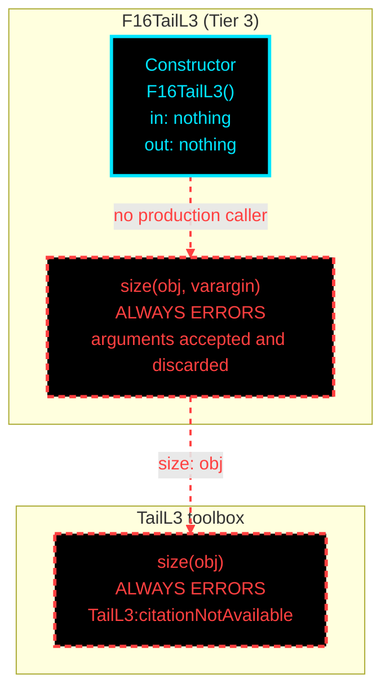

# F16TailL3: input-to-output data flow

This chart shows the data path for `F16TailL3`, the Level 3 (L3) tail-sizing
class.

**There is no data path. The whole tier is a citation gap.** `F16TailL3.size`
delegates to `TailL3.size`, which always errors. The Raymer Ch. 16
stability-based tail-sizing equations, HT sizing from a required static margin
and VT sizing from a required yaw-stability target plus crosswind, are not
verifiable from any source in this repository. They are not implemented, and
not guessed.

This is the only chart in the set where every node is red.

**Casey's proposed resolution, 2026-08-14:** delete the L1 tier, promote the
current L1 to L2 and the current L2 to L3. Tail sizing then has no L1, matching
landing gear and stability and control, and this erroring tier disappears. See
P-1 in [first_pass_findings.md](../../first_pass_findings.md) for what that fixes,
what it leaves open, and the measured rename cost.

**Read this first.**
- The constructor takes no arguments and sets nothing.
- `size(obj, varargin)` accepts and discards any arguments, so a caller written
  against the L1 or L2 signature still reaches the error rather than failing on
  arity.
- Red dashed marks a path with no production caller. Both nodes always error.
- The gap record is in `VnV/BrandtF16A/todo.md`, the 2026-07-28 Finding 3
  entry, and in the tail-sizing scribe plan, which also states what would
  resolve it.

## Field-by-field notes

| Class member | Source | Notes |
| --- | --- | --- |
| Everything | None | The class has no properties, no JSON, and no injected object. |
| `size(obj, varargin)` | Delegates to `TailL3.size` | Errors with `TailL3:citationNotAvailable`. |
| What is missing | Raymer Ch. 16 | HT sizing from a required static margin or `Cm_alpha`, and VT sizing from a required `Cn_beta` target plus a crosswind condition. Neither is verifiable from a source in this repo. |

Worth noting against the neighbouring disciplines: `F16SandCL3` DOES implement
the Ch. 16 longitudinal set, including the static margin and `Cm_alpha`. What is
missing here is the inverse problem. Computing the static margin of a given tail
is solved; sizing a tail to hit a required static margin is not.

## Methods with no upstream call at L3

| Method | Why |
| --- | --- |
| `F16TailL3.size` | Nothing calls it. It exists to satisfy the `TailSizingBase` contract. |
| `TailL3.size` | Reached only through the class method above. Both always error. |

## Source files

| Item | File |
| --- | --- |
| Concrete class | `examples/F16A/models/disciplines/tail/F16TailL3.m` |
| Tier 2, abstract | `src/disciplines/tail_sizing/TailSizingModelL3.m`, empty |
| Tier 1, base | `src/base/TailSizingBase.m` |
| Toolbox | `src/disciplines/tail_sizing/TailL3.m` |
| Gap record | `VnV/BrandtF16A/todo.md` 2026-07-28 Finding 3; `src/disciplines/tail_sizing/TailSizing_scribe_plan.md` Sec. 6 |
| Input JSON | None |
