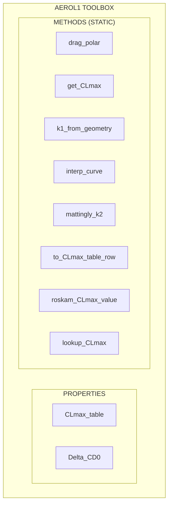

Written by Casey Chamberlain
8/14/2026

```mermaid
flowchart TD

subgraph AEROl1["AEROL1 TOOLBOX"]
    subgraph PROPERTIES["PROPERTIES"]
        direction LR
            CLMAX_TABLE["CLmax_table"]
            DELTACD0["Delta_CD0"]
    end

    subgraph METHODS_STATIC["METHODS (STATIC)"]
        direction LR
            DRAG_POLAR["drag_polar"]
            GET_CLMAX["get_CLmax"]
            K1_FROM_GEOM["k1_from_geometry"]
            INTERP_CURVE["interp_curve"]
            MATTINGLY_K2["mattingly_k2"]
            TO_CLMAX_TABLE_ROW["to_CLmax_table_row"]
            ROSKAM_CLMAX_VALUE["roskam_CLmax_value"]
            LOOKUP_CLMAX["lookup_CLmax"]
    end
end


```