# Sizing-loop dependency diagrams

```
################################################################################
################################################################################
##                                                                            ##
##      #####   ####     ##   #####    ##   ##   ####     ##  ###   ##        ##
##      ##  ##  ##  ##  ####  ##  ##  ####  ##  ##  ##   ####  ##   ##        ##
##      #####   ####   ##  ## ##  ## ##  ## ##  ##  ##  ##  ## ##   ##        ##
##                                                                            ##
##            THIS FILE WAS ORIGINALLY WRITTEN ON 2026-08-13                   ##
##            THIS FILE WAS ORIGINALLY WRITTEN ON 2026-08-13                   ##
##            THIS FILE WAS ORIGINALLY WRITTEN ON 2026-08-13                   ##
##                                                                            ##
##      >>>  IT WAS COMMITTED LATER, ON 2026-08-14.  <<<                       ##
##      >>>  THE COMMIT DATE IS NOT THE WRITE DATE.  <<<                       ##
##                                                                            ##
##      Every statement in this file describes the code as it stood on         ##
##      2026-08-13. CHECK IT AGAINST THE SOURCE BEFORE YOU TRUST IT.           ##
##                                                                            ##
################################################################################
################################################################################
```

> ## ORIGINALLY WRITTEN: **2026-08-13**
>
> Committed 2026-08-14. The file sat untracked for one day, so git records no
> history before the commit. The write date comes from the file's own modified
> timestamp, which is the only record of it.

Mermaid diagrams of `SizingLoopL1` and `SizingLoopL2`, traced to every class,
method and property that the loops call or read at run time. The diagrams show
the iteration loop and the implicit feedback paths.

Closes the in-code request at `SizingLoopL2.m:479` ("Make a mermaid chart to see
exactly what data goes where during runtime. Don't forget the loop.").

**Read this first.** Two different arrow types are used:

| Arrow | Meaning |
| --- | --- |
| solid | An explicit call or an explicit property write in the loop body. |
| dotted | An implicit path. No argument carries the value. A `Dependent` getter reads a handle live, so the next read gets the new value. |

The colour classes are the same in every diagram:

| Colour | Kind of node |
| --- | --- |
| blue | Orchestrator or aggregator |
| green | Concrete F-16 discipline object (Tier 3) |
| orange | Static equation toolbox (not in the inheritance chain) |
| grey | Generic Layer-1 class, base class, or data file |

**Fidelity note.** `SizingLoopL2` serves both L2 and L3. Where the two rungs
differ, the diagram marks the node. There is no L3 propulsion tier, so the L3
rung uses `F16PropL2`.

---

## 1. Level 1: object graph

What `design_study_01_L1.m` builds, and which object holds which handle.

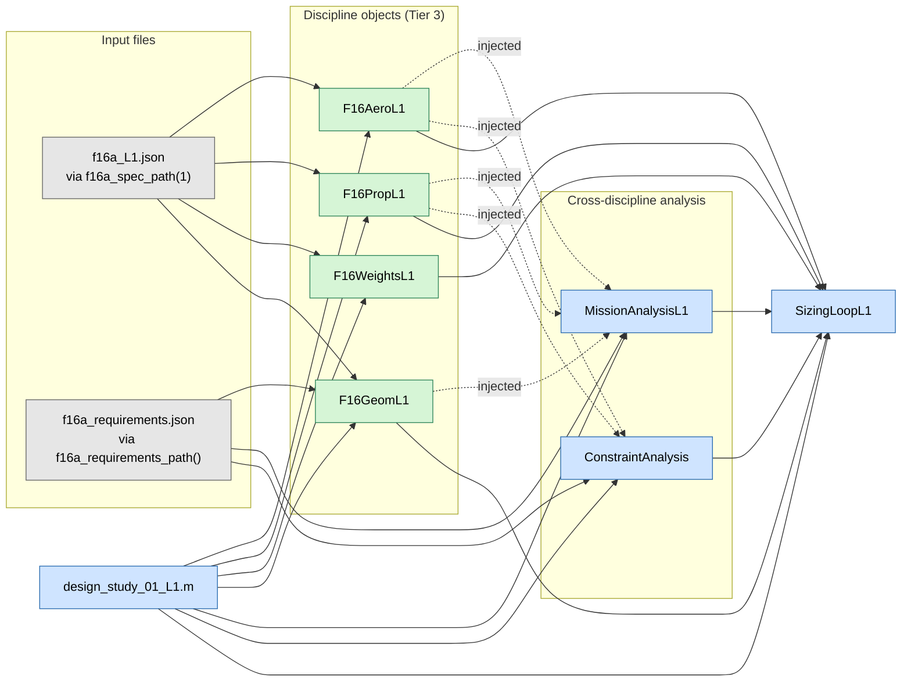

**Point to note.** `F16AeroL1` takes no geometry object. It reads `AR` and
`Lambda_LE_deg` as plain spec scalars. This is what makes the L1 constraint
envelope independent of `S_ref`, and it is why `SizingLoopL1` calls
`con.optimal_point()` one time only, before the loop.

---

## 2. Level 1: one iteration, with the loop

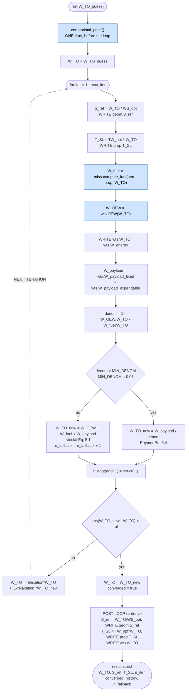

**Two facts about the L1 loop that the diagram makes visible.**

1. `prop.T_SL` is write-only inside the L1 loop. `PropL1.get_thrust_lapse` is a
   density-ratio law, so it does not read `T_SL`. The L1 mission uses only
   `FixedFractionSegment`, `BreguetRangeSegment` and `BreguetEnduranceSegment`,
   and none of those read `prop.T_SL` either. `T_SL` is therefore a pure output
   at L1.
2. The loop does not set `geom.W_TO`. `F16GeomL1.S_wet` and
   `F16GeomL1.L_fuselage` are `Dependent` on `W_TO` and error if read before it
   is set. Nothing in the L1 loop reads them, because `F16AeroL1` holds no
   geometry object and the mission reads only `geom.get_S_ref()` and
   `geom.n_engines`.

---

## 3. Level 2 and Level 3: object graph

`design_study_02_L2.m` and `design_study_03_L3.m` build the same shape. The
differences are marked.

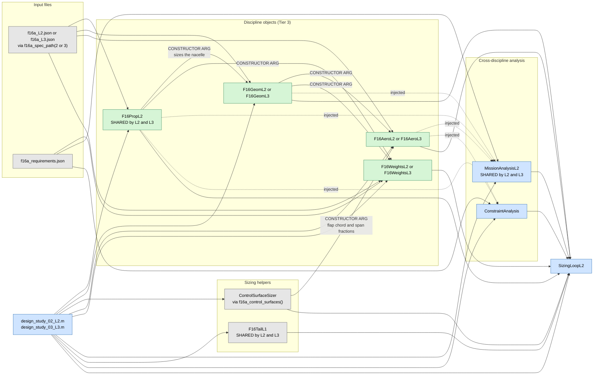

**Construction order is not free.** `prop` must exist before `geom`, because
`geom.T_AB_SLS_lb` is `Dependent` on `prop.T_SL`. `ctrl` must exist before
`aero`, because the aero high-lift model reads the flaperon and leading-edge-flap
fractions off `ctrl`.

---

## 4. Level 2 and Level 3: one iteration, with the loop

The order of the blocks is significant. The comments in `SizingLoopL2.m` state
why. The diagram keeps that order.

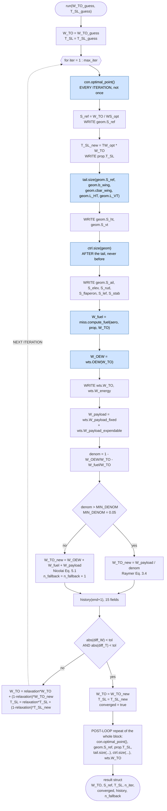

### 4b. The feedback paths inside one L2 or L3 iteration

The block order above hides the couplings, because no argument carries them.
This diagram shows the same iteration as a data-flow graph. Every dotted edge is
a `Dependent` getter that reads a shared handle live.

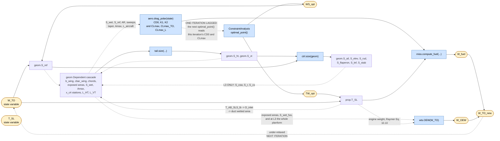

**Why `optimal_point()` runs every iteration at L2 and L3, but one time at L1.**
The dotted edge from `aero` back to `ConstraintAnalysis` closes a real loop.
`geom.S_ref` and `prop.T_SL` both move the wetted area, therefore `CD0`,
therefore every constraint curve. Each call reads the previous iteration's
values, because the loop assigns this iteration's values immediately after the
call. That one-iteration lag is the same lag the under-relaxed state variables
have.

**The L2 and L3 difference in the control-surface path.** At L3 the six areas
feed `geom.S_csw`, `geom.S_r` and `geom.S_cs`, which the Raymer Eq. 15.1, 15.3
and 15.17 weight terms consume. At L2 the areas reach only `history` and the
report scripts, because `F16GeomL2` declares no such properties and
`F16WeightsL2` consumes none.

---

## 5. `ConstraintAnalysis.optimal_point()`, expanded

Both loops enter this subtree. The constraint set comes from
`F16ConstraintSet.constraint_map()`, and the sweep is
`PointPerformanceBase.WS_RANGE_SIZING`, 31 points from 20 to 160 psf.

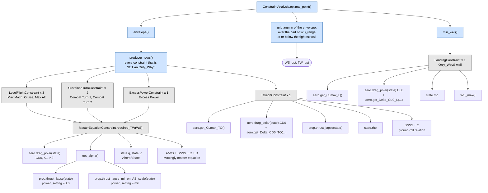

**Note on `get_Delta_CD0_TO` and `get_Delta_CD0_L`.** The arity is not uniform
across the fidelity levels. `F16AeroL1` and `F16AeroL2` take no argument.
`F16AeroL3` takes the flight state, for a gear-strut Reynolds-number lookup.
`TakeoffConstraint` and `LandingConstraint` each dispatch on the declared
`InputNames` by metaclass reflection.

**Note on `StallConstraint`.** The class exists and has unit tests, but the
requirements JSON carries no Stall condition, so no Stall wall is built for the
F-16.

---

## 6. `miss.compute_fuel(...)`, expanded: Level 1

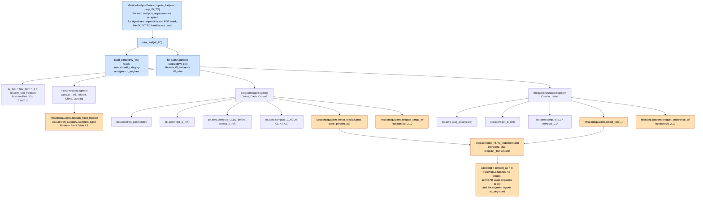

---

## 7. `miss.compute_fuel(...)`, expanded: Level 2 and Level 3

`MissionAnalysisL2` serves both rungs. There is no L3 mission tier.

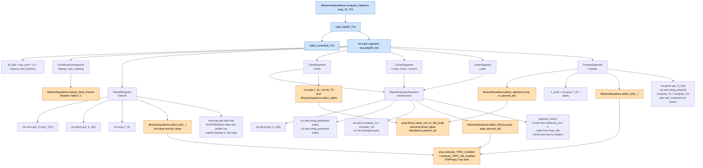

---

## 8. `tail.size(...)` and `ctrl.size(geom)`, expanded

L2 and L3 only. `SizingLoopL1` has neither object.

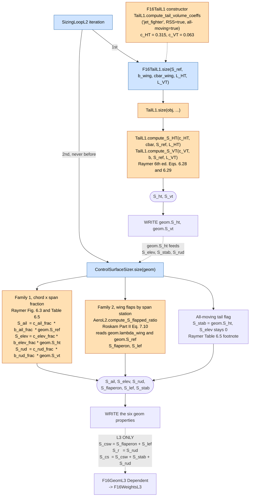

**Why the order is fixed.** `S_elev`, `S_stab` and `S_rud` are sized off `S_ht`
and `S_vt`. If the two blocks were reversed, they would use the previous
iteration's tail.

**Feedback in the tail arm.** `geom.L_HT` and `geom.L_VT` are `Dependent` on
`x_c4_wing`, `x_c4_ht` and `x_c4_vt`, which move with both `S_ref` and
`S_ht`/`S_vt`. The arm is therefore part of the fixed point, lagged by one
iteration. The lag is stable, because a larger `S_ht` makes the arm longer,
which makes the next `S_ht` smaller.

---

## 9. `wts.OEW(W_TO)`, expanded, all three levels

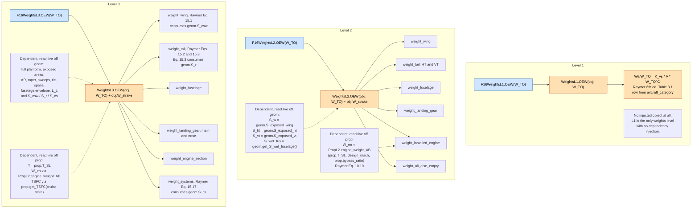

**`OEW` takes `W_TO` as an argument at every level.** The loop's current iterate
is passed in. It is not read off `obj.W_TO`. The loop writes `wts.W_TO` after the
call, for the reporting scripts and for the `Dependent` weight-breakdown
properties.

---

## 10. The geometry `Dependent` cascade

This is the mechanism behind most of the dotted edges above. Nothing is cached.
Every getter recomputes on read.

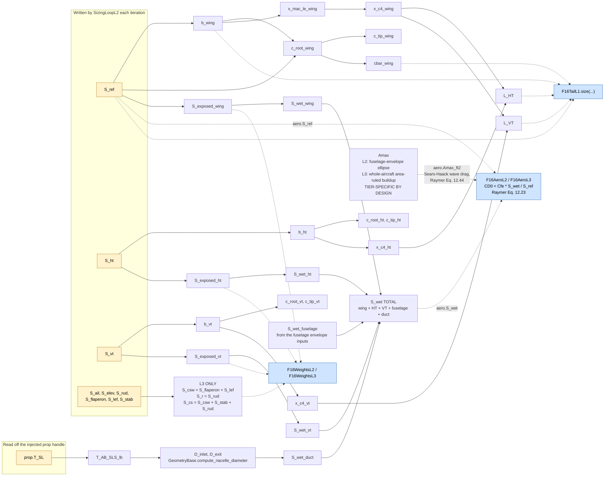

---

## 11. Class inheritance

The three-tier discipline pattern, plus the classes the two loops touch. The
static toolboxes (`AeroL1`, `GeomL2`, `PropL2`, `WeightsL3`, `TailL1`,
`MissionEquations`, ...) are **not** in any inheritance chain. They are shown in
the diagrams above as call targets only.

```mermaid
classDiagram
    class SizingLoopL1 {
        <<handle>>
        +MIN_DENOM 0.05
        +run(W_TO_guess, opts) result
    }
    class SizingLoopL2 {
        <<handle>>
        +MIN_DENOM 0.05
        +run(W_TO_guess, T_SL_guess, opts) result
    }

    class AerodynamicsBase {
        <<abstract handle>>
        +drag_polar(state)*
        +get_CLmax(state)*
        +compute_CD(CD0,K1,K2,CL)
        +compute_CL(L,q,S_ref)
    }
    class PropulsionBase {
        <<abstract handle>>
        +T_SL*
        +thrust_lapse(state)*
        +get_TSFC(state)*
        +thrust_lapse_mil_on_AB_scale(state)
    }
    class WeightsBase {
        <<abstract handle>>
        +W_TO*
        +W_energy*
        +W_payload_fixed*
        +W_payload_expendable*
        +OEW(W_TO)*
    }
    class GeometryBase {
        <<abstract handle>>
        +get_S_ref()*
        +get_S_wet()*
    }
    class MissionAnalysisBase {
        <<abstract handle>>
        +total_fuel(W_TO)
        +compute_fuel(aero, prop, W_TO)
        +build_context(W_TO)
    }
    class ConstraintAnalysis {
        <<value class>>
        +optimal_point() WS_opt_and_TW_opt
        +envelope() TW_envelope
        +from_requirements(aero, prop, json_path, classMap, WS_range)$
    }
    class TailSizingBase {
        <<abstract handle>>
        +size(S_ref,b,cbar,L_HT,L_VT)*
    }
    class ControlSurfaceSizer {
        <<handle>>
        +size(geom) result
    }
    class PointPerformanceBase {
        <<abstract handle>>
        +WS_RANGE_BRANDT
        +WS_RANGE_SIZING
        +constraint_residual(dp)*
    }
    class MissionSegment {
        <<abstract handle>>
        +step(W_before, ctx)
        +fuel_burn(ctx)*
    }
    class AircraftState {
        <<value class>>
        +rho, q, V, mach, altitude_ft
        +theta, delta
    }

    AerodynamicsBase <|-- AeroModelL1
    AerodynamicsBase <|-- AeroModelL2
    AerodynamicsBase <|-- AeroModelL3
    AeroModelL1 <|-- F16AeroL1
    AeroModelL2 <|-- F16AeroL2
    AeroModelL3 <|-- F16AeroL3

    PropulsionBase <|-- PropulsionModelL1
    PropulsionBase <|-- PropulsionModelL2
    PropulsionModelL1 <|-- F16PropL1
    PropulsionModelL2 <|-- F16PropL2

    WeightsBase <|-- WeightsModelL1
    WeightsBase <|-- WeightsModelL2
    WeightsBase <|-- WeightsModelL3
    WeightsModelL1 <|-- F16WeightsL1
    WeightsModelL2 <|-- F16WeightsL2
    WeightsModelL3 <|-- F16WeightsL3

    GeometryBase <|-- GeometryModelL1
    GeometryBase <|-- GeometryModelL2
    GeometryBase <|-- GeometryModelL3
    GeometryModelL1 <|-- F16GeomL1
    GeometryModelL2 <|-- F16GeomL2
    GeometryModelL3 <|-- F16GeomL3

    MissionAnalysisBase <|-- MissionAnalysisL1
    MissionAnalysisBase <|-- MissionAnalysisL2

    TailSizingBase <|-- TailSizingModelL1
    TailSizingModelL1 <|-- F16TailL1

    PointPerformanceBase <|-- Both_WbyS_TbyW
    PointPerformanceBase <|-- Only_WbyS
    PointPerformanceBase <|-- Only_TbyW
    Both_WbyS_TbyW <|-- MasterEquationConstraint
    Both_WbyS_TbyW <|-- TakeoffConstraint
    MasterEquationConstraint <|-- LevelFlightConstraint
    MasterEquationConstraint <|-- SustainedTurnConstraint
    MasterEquationConstraint <|-- ExcessPowerConstraint
    Only_WbyS <|-- LandingConstraint
    Only_WbyS <|-- StallConstraint

    MissionSegment <|-- FixedFractionSegment
    MissionSegment <|-- BreguetRangeSegment
    MissionSegment <|-- BreguetEnduranceSegment
    MissionSegment <|-- TakeoffSegment
    MissionSegment <|-- CombatSegment
    MissionSegment <|-- MasterEquationSegment
    MasterEquationSegment <|-- ClimbSegment
    MasterEquationSegment <|-- CruiseSegment
    MasterEquationSegment <|-- LoiterSegment

    SizingLoopL1 o-- AerodynamicsBase
    SizingLoopL1 o-- PropulsionBase
    SizingLoopL1 o-- WeightsBase
    SizingLoopL1 o-- GeometryBase
    SizingLoopL1 o-- MissionAnalysisBase
    SizingLoopL1 o-- ConstraintAnalysis

    SizingLoopL2 o-- AerodynamicsBase
    SizingLoopL2 o-- PropulsionBase
    SizingLoopL2 o-- WeightsBase
    SizingLoopL2 o-- GeometryBase
    SizingLoopL2 o-- MissionAnalysisBase
    SizingLoopL2 o-- ConstraintAnalysis
    SizingLoopL2 o-- TailSizingBase
    SizingLoopL2 o-- ControlSurfaceSizer

    ConstraintAnalysis o-- PointPerformanceBase
    MissionAnalysisBase o-- MissionSegment
    PointPerformanceBase ..> AircraftState
    MissionSegment ..> AircraftState
```

---

## 12. Difference summary, L1 against L2 and L3

| Item | `SizingLoopL1` | `SizingLoopL2`, used by L2 and L3 |
| --- | --- | --- |
| State variables | `W_TO` | `W_TO` and `T_SL` |
| Injected objects | 6 | 8, with `tail` and `ctrl` added |
| `con.optimal_point()` | One time, before the loop | Every iteration, plus one time after |
| Why | L1 aero is geometry-free and the L1 thrust lapse is self-normalized, so the envelope cannot move | `geom.S_ref` and `prop.T_SL` both move `S_wet`, therefore `CD0`, therefore every curve |
| `S_ref` | Solved, `W_TO / WS_opt` | Solved, `W_TO / WS_opt` |
| `prop.T_SL` inside the loop | Write-only, no reader | Read by `geom.T_AB_SLS_lb`, by the weights engine terms, and by the `TakeoffSegment`, `ClimbSegment` and `CombatSegment` |
| Tail and control surfaces | Not sized | Sized every iteration, tail first |
| Convergence test | `abs(W_TO_new - W_TO) < tol` | The same test on `W_TO` **and** on `T_SL` |
| Closure | Raymer Eq. 3.4, with the Nicolai Eq. 5.1 fallback | The same |
| `history` fields | 6 | 15 |

---

## 13. Source files

| Diagram | Primary source |
| --- | --- |
| 1, 2 | `src/sizing/SizingLoopL1.m`, `examples/F16A/design_study_01_L1.m` |
| 3, 4 | `src/sizing/SizingLoopL2.m`, `examples/F16A/design_study_02_L2.m`, `design_study_03_L3.m` |
| 5 | `src/constraints/*.m`, `examples/F16A/F16ConstraintSet.m`, `jsons/f16a_requirements.json` |
| 6, 7 | `src/core/mission/**`, `jsons/f16a_requirements.json` CAP profile |
| 8 | `src/disciplines/tail_sizing/TailL1.m`, `examples/F16A/F16TailL1.m`, `src/sizing/ControlSurfaceSizer.m`, `examples/F16A/f16a_control_surfaces.m` |
| 9 | `src/disciplines/weights/WeightsL*.m`, `examples/F16A/F16WeightsL*.m` |
| 10 | `examples/F16A/F16GeomL2.m`, `F16GeomL3.m`, `src/disciplines/geometry/GeomL2.m`, `GeomL3.m` |
| 11 | `src/base/*.m`, the full `src/` and `examples/F16A/` trees |
