# Sizing-loop dependency diagrams

> **REWRITTEN 2026-09-20, against the source at that date.**
>
> The previous version of this file was written on 2026-08-13 and described a
> loop design that had already been superseded. It was wrong in eleven places,
> several of them the kind that produce a wrong answer if you code from the
> diagram. The errata are in the last section, kept so that anyone working from
> a printout of the old version can see what changed.
>
> Primary sources for everything below: `src/sizing/SizingLoopL1.m`,
> `src/sizing/SizingLoopL2.m`, `src/sizing/SizingSteps.m`,
> `src/constraints/ConstraintAnalysis.m`, and the `f16_sizing_L*.m` drivers.
> The class headers are authoritative. Check against them before you trust this.

Mermaid diagrams of `SizingLoopL1` and `SizingLoopL2`, traced to every class,
method and property the loops call or read at run time. The diagrams show the
iteration and the implicit feedback paths.

**Read this first.** Two arrow types are used:

| Arrow | Meaning |
| --- | --- |
| solid | An explicit call, or an explicit property write in the loop body. |
| dotted | An implicit path. No argument carries the value. A `Dependent` getter reads a shared handle live, so the next read sees the new value. |

Colour classes:

| Colour | Kind of node |
| --- | --- |
| blue | Orchestrator or aggregator |
| green | Concrete Tier-3 discipline object |
| orange | Static equation toolbox (not in the inheritance chain) |
| grey | Generic Layer-1 class, base class, or data file |

**Fidelity note.** `SizingLoopL2` serves both the L2 and the L3 rungs. Where
they differ, the node is marked. There is no L3 propulsion tier, so the L3 rung
uses `F16PropL2`. There is no `SizingLoopL3`.

---

## 1. Level 1: object graph

What `f16_sizing_L1.m` builds, and which object holds which handle.

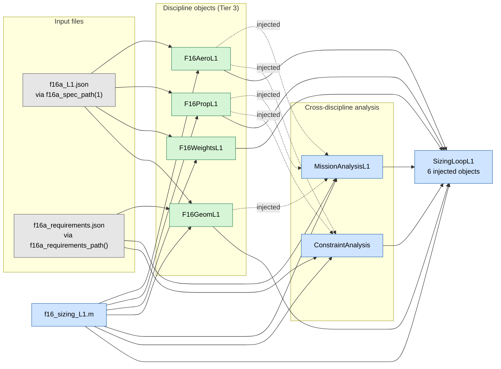
```mermaid
flowchart LR
    subgraph DATA["Input files"]
        SPEC1["f16a_L1.json<br/>via f16a_spec_path(1)"]
        REQ["f16a_requirements.json<br/>via f16a_requirements_path()"]
    end

    STUDY["f16_sizing_L1.m"]

    subgraph DISC["Discipline objects (Tier 3)"]
        AERO["F16AeroL1"]
        PROP["F16PropL1"]
        WTS["F16WeightsL1"]
        GEOM["F16GeomL1"]
    end

    subgraph ANALYSIS["Cross-discipline analysis"]
        MISS["MissionAnalysisL1"]
        CON["ConstraintAnalysis"]
    end

    LOOP["SizingLoopL1<br/>6 injected objects"]

    STUDY --> AERO
    STUDY --> PROP
    STUDY --> WTS
    STUDY --> GEOM
    STUDY --> MISS
    STUDY --> CON
    STUDY --> LOOP

    SPEC1 --> AERO
    SPEC1 --> PROP
    SPEC1 --> WTS
    SPEC1 --> GEOM
    REQ --> GEOM
    REQ --> MISS
    REQ --> CON

    AERO -. injected .-> MISS
    PROP -. injected .-> MISS
    GEOM -. injected .-> MISS
    AERO -. injected .-> CON
    PROP -. injected .-> CON

    AERO --> LOOP
    PROP --> LOOP
    WTS --> LOOP
    GEOM --> LOOP
    MISS --> LOOP
    CON --> LOOP

    classDef orch fill:#cfe4ff,stroke:#2b6cb0,color:#000
    classDef disc fill:#d6f5d6,stroke:#2f855a,color:#000
    classDef data fill:#e6e6e6,stroke:#666,color:#000
    class LOOP,MISS,CON,STUDY orch
    class AERO,PROP,WTS,GEOM disc
    class SPEC1,REQ data
```

**Point to note.** `F16AeroL1` takes no geometry object. It reads `AR` and
`Lambda_LE_deg` as plain spec scalars. That is what makes the L1 constraint
envelope independent of `S_ref`, and it is the reason `SizingLoopL1` calls
`con.optimal_point_continuous()` one time only, before the loop.

---

## 2. Level 1: one iteration, with the loop

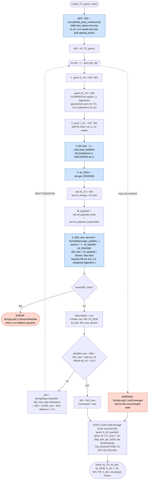
```mermaid
flowchart TD
    START(["run(W_TO_guess, opts)"]) --> OPT["[WS, TW] = con.optimal_point_continuous()<br/>ONE time, before the loop<br/>no x0, so it seeds from the grid optimal_point()"]
    OPT --> INIT["W0 = W_TO_guess"]
    INIT --> ITER{{"for iter = 1 : opts.max_iter"}}

    ITER --> S1["1. geom.S_ref = W0 / WS"]
    S1 --> S1B["geom.W_TO = W0<br/>GUARDED by isprop: L1 regression<br/>geometries carry W_TO, L2/L3 planforms do not"]
    S1B --> S2["2. prop.T_SL = TW * W0<br/>WRITE-ONLY at L1: no reader"]
    S2 --> S3["3. [W_fuel, ~] = miss.total_fuel(W0)<br/>the breakdown is DISCARDED at L1"]
    S3 --> S4["4. W_OEW = wts.get_OEW(W0)"]
    S4 --> S5["wts.W_TO = W0<br/>wts.W_energy = W_fuel"]
    S5 --> S6["W_payload = wts.W_payload_fixed<br/>+ wts.W_payload_expendable"]
    S6 --> S7["5. [W0_new, denom] = SizingSteps.togw_update(...)<br/>denom = 1 - W_fuel/W0 - W_OEW/W0<br/>W0_new = W_payload / denom, else NaN<br/>Raymer 6th ed. Eq. 3.4; metabook Algorithm 1"]
    S7 --> NANQ{"isnan(W0_new)?"}
    NANQ -- yes --> ERR(["ERROR SizingLoopL1:closureInfeasible<br/>there is no fallback equation"])
    NANQ -- no --> HIST["history(iter) = row<br/>6 fields: iter, W0, W_OEW,<br/>W_fuel, W0_new, denom"]
    HIST --> CONV{"abs(W0_new - W0) / W0_new < opts.tol_rel<br/>default tol_rel = 1e-6"}
    CONV -- no --> RELAX["W0 = SizingSteps.relax(W0, W0_new, opts.relaxation)<br/>= W0 + w*(W0_new - W0), default w = 0.5"]
    RELAX -.->|"NEXT ITERATION"| ITER
    CONV -- yes --> DONE["W0 = W0_new<br/>converged = true"]

    ITER -.->|"max_iter reached"| WARN["WARNING SizingLoopL1:notConverged<br/>returns the unconverged state"]
    WARN --> POST
    DONE --> POST["POST-LOOP write-through at the returned W0:<br/>geom.S_ref, guarded geom.W_TO, prop.T_SL,<br/>total_fuel, get_OEW, wts bookkeeping.<br/>The DESIGN POINT IS NOT RE-SOLVED."]
    POST --> RESULT(["result: W_TO, W_fuel, W_OEW, S_ref, T_SL,<br/>WS, TW, n_iter, converged, history"])

    classDef orch fill:#cfe4ff,stroke:#2b6cb0,color:#000
    classDef bad fill:#ffd9d0,stroke:#c0482a,color:#000
    class OPT,S3,S4,S7 orch
    class ERR,WARN bad
```

**Two facts the diagram makes visible.**

1. `prop.T_SL` is write-only inside the L1 loop. `PropL1.get_thrust_lapse` is a
   density-ratio law and does not read `T_SL`. The L1 mission uses only
   `FixedFractionSegment`, `BreguetRangeSegment` and `BreguetEnduranceSegment`,
   none of which read `prop.T_SL`. So `T_SL` is a pure output at L1.
2. The `geom.W_TO` write is guarded by `isprop`. `F16GeomL1.S_wet` and
   `F16GeomL1.L_fuselage` are `Dependent` on `W_TO` and error if read before it
   is set; an L2/L3 planform geometry has no such property at all.

**The relaxation convention, because it is the easiest thing to get backwards:**

```matlab
function x = relax(x_old, x_new, w)
    x = x_old + w * (x_new - x_old);    % w weights the NEW value
end
```

`w = 1` is the full undamped step. `w = 0.5` is the default. The docstring adds
the tuning rule: an aircraft with a large fixed-OEW content has a steep
closure-map slope and needs a smaller `w` (Brandt F-16A slope about -2.9, so
`w` about 0.25).

---

## 3. Level 2 and Level 3: object graph

`f16_sizing_L2.m` and `f16_sizing_L3.m` build the same shape. The differences
are marked. **Seven objects reach the loop, not eight:** `ControlSurfaceSizer`
is not one of them.

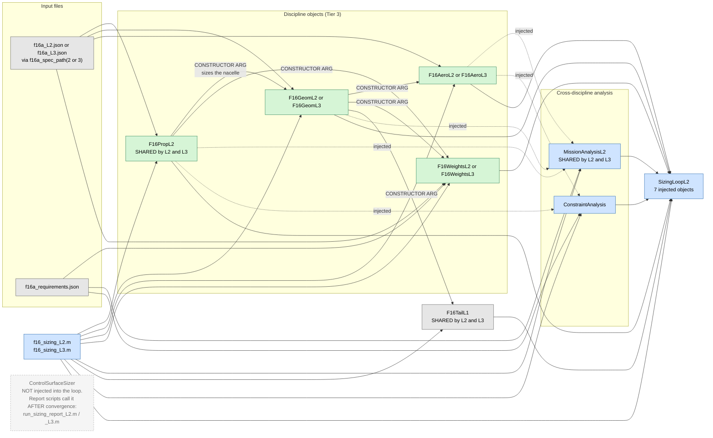
```mermaid
flowchart LR
    subgraph DATA["Input files"]
        SPEC["f16a_L2.json or f16a_L3.json<br/>via f16a_spec_path(2 or 3)"]
        REQ["f16a_requirements.json"]
    end

    STUDY["f16_sizing_L2.m<br/>f16_sizing_L3.m"]

    subgraph DISC["Discipline objects (Tier 3)"]
        PROP["F16PropL2<br/>SHARED by L2 and L3"]
        GEOM["F16GeomL2 or F16GeomL3"]
        AERO["F16AeroL2 or F16AeroL3"]
        WTS["F16WeightsL2 or F16WeightsL3"]
    end

    TAIL["F16TailL1<br/>SHARED by L2 and L3"]

    subgraph ANALYSIS["Cross-discipline analysis"]
        MISS["MissionAnalysisL2<br/>SHARED by L2 and L3"]
        CON["ConstraintAnalysis"]
    end

    LOOP["SizingLoopL2<br/>7 injected objects"]

    STUDY --> PROP
    STUDY --> GEOM
    STUDY --> AERO
    STUDY --> WTS
    STUDY --> MISS
    STUDY --> TAIL
    STUDY --> CON
    STUDY --> LOOP

    SPEC --> PROP
    SPEC --> GEOM
    SPEC --> AERO
    SPEC --> WTS
    REQ --> WTS
    REQ --> MISS
    REQ --> CON

    PROP -->|"CONSTRUCTOR ARG<br/>sizes the nacelle"| GEOM
    GEOM -->|"CONSTRUCTOR ARG"| AERO
    GEOM -->|"CONSTRUCTOR ARG"| WTS
    PROP -->|"CONSTRUCTOR ARG"| WTS
    GEOM -->|"CONSTRUCTOR ARG"| TAIL

    AERO -. injected .-> MISS
    PROP -. injected .-> MISS
    GEOM -. injected .-> MISS
    AERO -. injected .-> CON
    PROP -. injected .-> CON

    AERO --> LOOP
    PROP --> LOOP
    WTS --> LOOP
    GEOM --> LOOP
    MISS --> LOOP
    CON --> LOOP
    TAIL --> LOOP

    CTRL["ControlSurfaceSizer<br/>NOT injected into the loop.<br/>Report scripts call it AFTER convergence:<br/>run_sizing_report_L2.m / _L3.m"]

    classDef orch fill:#cfe4ff,stroke:#2b6cb0,color:#000
    classDef disc fill:#d6f5d6,stroke:#2f855a,color:#000
    classDef data fill:#e6e6e6,stroke:#666,color:#000
    classDef out fill:#f5f5f5,stroke:#aaa,color:#666,stroke-dasharray: 4 3
    class LOOP,MISS,CON,STUDY orch
    class PROP,GEOM,AERO,WTS disc
    class TAIL,SPEC,REQ data
    class CTRL out
```

**Construction order is not free.** `prop` must exist before `geom`, because
`F16GeomL2.T_AB_SLS_lb` is `Dependent` on `prop.T_SL`. `geom` must exist before
`aero`, `wts` and `tail`, all of which take it as a constructor argument.

---

## 4. Level 2 and Level 3: one iteration, with the loop

The block order is significant and the comments in `SizingLoopL2.m` say why.
The diagram keeps that order.

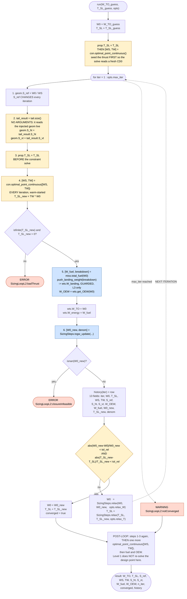
```mermaid
flowchart TD
    START(["run(W_TO_guess, T_SL_guess, opts)"]) --> INIT["W0 = W_TO_guess<br/>T_SL = T_SL_guess"]
    INIT --> SEED["prop.T_SL = T_SL<br/>THEN [WS, TW] = con.optimal_point_continuous()<br/>seed the thrust FIRST so the solve reads a fresh CD0"]
    SEED --> ITER{{"for iter = 1 : opts.max_iter"}}

    ITER --> A1["1. geom.S_ref = W0 / WS<br/>S_ref CHANGES every iteration"]
    A1 --> A2["2. tail_result = tail.size()<br/>NO ARGUMENTS: it reads the injected geom live<br/>geom.S_ht = tail_result.S_ht<br/>geom.S_vt = tail_result.S_vt"]
    A2 --> A3["3. prop.T_SL = T_SL<br/>BEFORE the constraint solve"]
    A3 --> A4["4. [WS, TW] = con.optimal_point_continuous([WS, TW])<br/>EVERY iteration, warm-started<br/>T_SL_new = TW * W0"]
    A4 --> A4Q{"isfinite(T_SL_new) and T_SL_new > 0?"}
    A4Q -- no --> ERRT(["ERROR SizingLoopL2:badThrust"])
    A4Q -- yes --> A5["5. [W_fuel, breakdown] = miss.total_fuel(W0)<br/>push_landing_weight(breakdown)<br/>-> wts.W_landing, GUARDED, L3 only<br/>W_OEW = wts.get_OEW(W0)"]
    A5 --> A5B["wts.W_TO = W0<br/>wts.W_energy = W_fuel"]
    A5B --> A6["6. [W0_new, denom] = SizingSteps.togw_update(...)"]
    A6 --> NANQ{"isnan(W0_new)?"}
    NANQ -- yes --> ERRC(["ERROR SizingLoopL2:closureInfeasible"])
    NANQ -- no --> HIST["history(iter) = row<br/>13 fields: iter, W0, T_SL, WS, TW, S_ref,<br/>S_ht, S_vt, W_OEW, W_fuel, W0_new,<br/>T_SL_new, denom"]
    HIST --> CONV{"abs(W0_new-W0)/W0_new < tol_rel<br/>AND<br/>abs(T_SL_new-T_SL)/T_SL_new < tol_rel"}
    CONV -- no --> RELAX["W0   = SizingSteps.relax(W0,   W0_new,   opts.relax_W)<br/>T_SL = SizingSteps.relax(T_SL, T_SL_new, opts.relax_T)"]
    RELAX -.->|"NEXT ITERATION"| ITER
    CONV -- yes --> DONE["W0 = W0_new<br/>T_SL = T_SL_new<br/>converged = true"]

    ITER -.->|"max_iter reached"| WARN["WARNING SizingLoopL2:notConverged"]
    WARN --> POST
    DONE --> POST["POST-LOOP: steps 1-3 again, THEN one more<br/>optimal_point_continuous([WS, TW]),<br/>then fuel and OEW.<br/>Level 1 does NOT re-solve the design point here."]
    POST --> RESULT(["result: W_TO, T_SL, S_ref, WS, TW, S_ht, S_vt,<br/>W_fuel, W_OEW, n_iter, converged, history"])

    classDef orch fill:#cfe4ff,stroke:#2b6cb0,color:#000
    classDef new fill:#fff2cc,stroke:#b7791f,color:#000
    classDef bad fill:#ffd9d0,stroke:#c0482a,color:#000
    class A5,A6 orch
    class SEED,A2,A3,A4,CONV new
    class ERRT,ERRC,WARN bad
```

Note the option names differ between the two loops: L1 takes `opts.relaxation`,
L2 takes `opts.relax_W` and `opts.relax_T`. Passing `'relaxation'` to
`SizingLoopL2.run` is an error, not a silent default.

### 4b. The feedback paths inside one L2 or L3 iteration

The block order above hides the couplings, because no argument carries them.
Same iteration, drawn as a data-flow graph. Every dotted edge is a `Dependent`
getter reading a shared handle live.

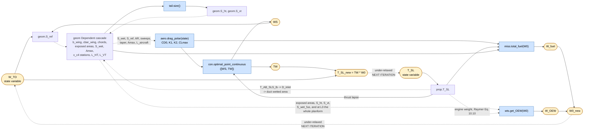
```mermaid
flowchart LR
    WTO(["W_TO<br/>state variable"])
    TSL(["T_SL<br/>state variable"])

    SREF["geom.S_ref"]
    TAILS["tail.size()"]
    SHT["geom.S_ht, geom.S_vt"]
    PTSL["prop.T_SL"]

    CON["con.optimal_point_continuous<br/>([WS, TW])"]
    WSOPT(["WS"])
    TWOPT(["TW"])

    GEOMD["geom Dependent cascade<br/>b_wing, cbar_wing, chords,<br/>exposed areas, S_wet, Amax,<br/>x_c4 stations, L_HT, L_VT"]

    AERO["aero.drag_polar(state)<br/>CD0, K1, K2, CLmax"]
    MISS["miss.total_fuel(W0)"]
    WTS["wts.get_OEW(W0)"]

    WFUEL(["W_fuel"])
    WOEW(["W_OEW"])
    NEW(["W0_new"])
    TNEW(["T_SL_new = TW * W0"])

    WTO --> SREF
    WSOPT --> SREF
    SREF -.-> GEOMD
    GEOMD --> TAILS
    TAILS --> SHT
    SHT -.-> GEOMD

    TSL --> PTSL
    PTSL -.->|"T_AB_SLS_lb -> D_inlet<br/>-> duct wetted area"| GEOMD

    GEOMD -.->|"S_wet, S_ref, AR, sweeps,<br/>taper, Amax, L_aircraft"| AERO
    AERO --> CON
    PTSL -->|"thrust lapse"| CON
    CON --> WSOPT
    CON --> TWOPT
    TWOPT --> TNEW
    WTO --> TNEW

    AERO --> MISS
    PTSL --> MISS
    GEOMD --> MISS
    MISS --> WFUEL

    GEOMD -.->|"exposed areas, S_ht, S_vt,<br/>S_wet_fus, and at L3 the whole planform"| WTS
    PTSL -.->|"engine weight, Raymer Eq. 10.10"| WTS
    WTS --> WOEW

    WFUEL --> NEW
    WOEW --> NEW
    NEW -.->|"under-relaxed<br/>NEXT ITERATION"| WTO
    TNEW -.->|"under-relaxed<br/>NEXT ITERATION"| TSL

    classDef orch fill:#cfe4ff,stroke:#2b6cb0,color:#000
    classDef state fill:#fff2cc,stroke:#b7791f,color:#000
    class CON,MISS,WTS,AERO,TAILS orch
    class WTO,TSL,WSOPT,TWOPT,WFUEL,WOEW,NEW,TNEW state
```

**Why `optimal_point_continuous()` runs every iteration at L2 and L3 but one
time at L1.** `geom.S_ref` and `prop.T_SL` both move `S_wet`, therefore `CD0`,
therefore every constraint curve. Steps 1 to 3 write those two before step 4
calls the solve, so the solve reads **this** iteration's drag. At L1 the aero
object holds no geometry, so the envelope cannot move and there is nothing to
re-solve.

---

## 5. `ConstraintAnalysis.optimal_point_continuous()`, expanded

Both loops enter this subtree. The constraint set comes from
`F16ConstraintSet.constraint_map()`, and the F-16 sweep is
`PointPerformanceBase.WS_RANGE_BRANDT`.

Note that `ConstraintAnalysis` is a **value** class, not a handle. The loop's
`obj.con` is a copy. Live reads still work, because the `constraints` cell holds
`PointPerformanceBase` **handle** objects that hold handles to the same
`aero`/`prop`.

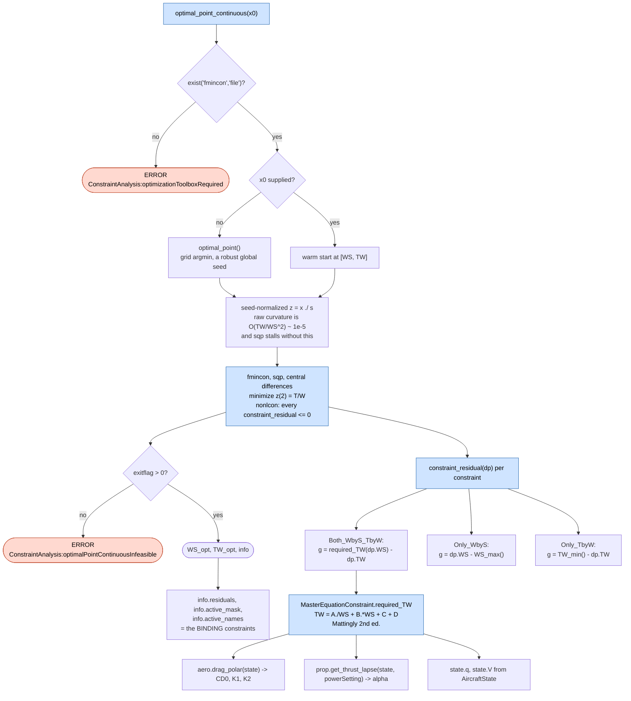
```mermaid
flowchart TD
    OPC["optimal_point_continuous(x0)"]
    OPC --> GUARD{"exist('fmincon','file')?"}
    GUARD -- no --> ERRTB(["ERROR<br/>ConstraintAnalysis:optimizationToolboxRequired"])
    GUARD -- yes --> SEED{"x0 supplied?"}
    SEED -- no --> GRID["optimal_point()<br/>grid argmin, a robust global seed"]
    SEED -- yes --> WARM["warm start at [WS, TW]"]
    GRID --> SCALE
    WARM --> SCALE["seed-normalized z = x ./ s<br/>raw curvature is O(TW/WS^2) ~ 1e-5<br/>and sqp stalls without this"]
    SCALE --> FMIN["fmincon, sqp, central differences<br/>minimize z(2) = T/W<br/>nonlcon: every constraint_residual <= 0"]
    FMIN --> EXIT{"exitflag > 0?"}
    EXIT -- no --> ERRINF(["ERROR<br/>ConstraintAnalysis:optimalPointContinuousInfeasible"])
    EXIT -- yes --> OUT(["WS_opt, TW_opt, info"])
    OUT --> INFO["info.residuals, info.active_mask,<br/>info.active_names<br/>= the BINDING constraints"]

    FMIN --> RES["constraint_residual(dp) per constraint"]
    RES --> R1["Both_WbyS_TbyW:<br/>g = required_TW(dp.WS) - dp.TW"]
    RES --> R2["Only_WbyS:<br/>g = dp.WS - WS_max()"]
    RES --> R3["Only_TbyW:<br/>g = TW_min() - dp.TW"]

    R1 --> ME["MasterEquationConstraint.required_TW<br/>TW = A./WS + B.*WS + C + D<br/>Mattingly 2nd ed."]
    ME --> MEA["aero.drag_polar(state) -> CD0, K1, K2"]
    ME --> MEP["prop.get_thrust_lapse(state, powerSetting) -> alpha"]
    ME --> MES["state.q, state.V from AircraftState"]

    classDef orch fill:#cfe4ff,stroke:#2b6cb0,color:#000
    classDef bad fill:#ffd9d0,stroke:#c0482a,color:#000
    class OPC,FMIN,RES,ME orch
    class ERRTB,ERRINF bad
```

**Sign convention**, declared in `PointPerformanceBase`: `g = required -
available`, so `g <= 0` is feasible, on the sea-level-static `T_SL/W_TO` basis
with no thrust-lapse scaling. `g = -margin`.

**The grid method is still there.** `optimal_point()` walks `WS_range`, takes
the minimum envelope value at or below the tightest wall, and breaks ties to the
**highest** `W/S` (a jet is better down and to the right). It seeds the
continuous solve, and it is the Optimization-Toolbox-free reference the tests
compare against. The sizing loops themselves call the continuous version.

---

## 6. `miss.total_fuel(W0)`, expanded: Level 1

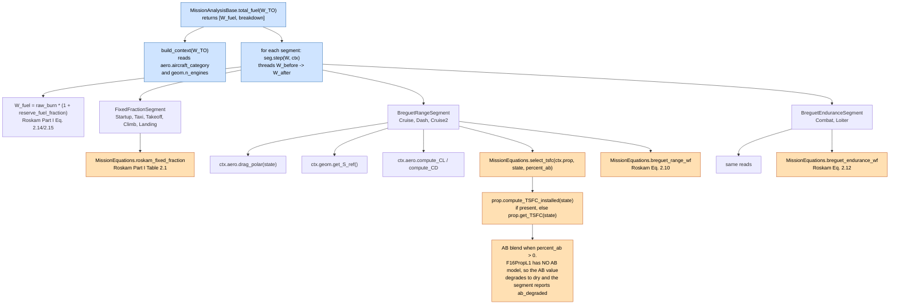
```mermaid
flowchart TD
    TF["MissionAnalysisBase.total_fuel(W_TO)<br/>returns [W_fuel, breakdown]"]
    TF --> CTX["build_context(W_TO)<br/>reads aero.aircraft_category<br/>and geom.n_engines"]
    TF --> LOOP2["for each segment: seg.step(W, ctx)<br/>threads W_before -> W_after"]
    LOOP2 --> RES["W_fuel = raw_burn * (1 + reserve_fuel_fraction)<br/>Roskam Part I Eq. 2.14/2.15"]

    LOOP2 --> FF["FixedFractionSegment<br/>Startup, Taxi, Takeoff, Climb, Landing"]
    LOOP2 --> BR["BreguetRangeSegment<br/>Cruise, Dash, Cruise2"]
    LOOP2 --> BE["BreguetEnduranceSegment<br/>Combat, Loiter"]

    FF --> FFA["MissionEquations.roskam_fixed_fraction<br/>Roskam Part I Table 2.1"]

    BR --> BRA["ctx.aero.drag_polar(state)"]
    BR --> BRB["ctx.geom.get_S_ref()"]
    BR --> BRC["ctx.aero.compute_CL / compute_CD"]
    BR --> BRE["MissionEquations.select_tsfc(ctx.prop, state, percent_ab)"]
    BR --> BRF["MissionEquations.breguet_range_wf<br/>Roskam Eq. 2.10"]

    BE --> BEA["same reads"]
    BE --> BEE["MissionEquations.breguet_endurance_wf<br/>Roskam Eq. 2.12"]

    BRE --> TSFC["prop.compute_TSFC_installed(state)<br/>if present, else prop.get_TSFC(state)"]
    TSFC --> TSFCAB["AB blend when percent_ab > 0.<br/>F16PropL1 has NO AB model, so the AB value<br/>degrades to dry and the segment reports ab_degraded"]

    classDef orch fill:#cfe4ff,stroke:#2b6cb0,color:#000
    classDef tb fill:#ffe0b3,stroke:#c05621,color:#000
    class TF,CTX,LOOP2 orch
    class FFA,BRE,BRF,BEE,TSFC,TSFCAB tb
```

`SizingLoopL1` discards the breakdown (`[W_fuel, ~]`). `SizingLoopL2` keeps it,
for `push_landing_weight`.

---

## 7. `miss.total_fuel(W0)`, expanded: Level 2 and Level 3

`MissionAnalysisL2` serves both rungs. There is no L3 mission tier.

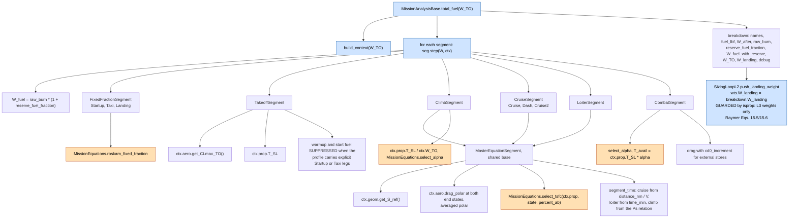
```mermaid
flowchart TD
    TF["MissionAnalysisBase.total_fuel(W_TO)"]
    TF --> CTX["build_context(W_TO)"]
    TF --> SEG["for each segment: seg.step(W, ctx)"]
    SEG --> RES["W_fuel = raw_burn * (1 + reserve_fuel_fraction)"]
    TF --> BD["breakdown: names, fuel_lbf, W_after, raw_burn,<br/>reserve_fuel_fraction, W_fuel_with_reserve,<br/>W_TO, W_landing, debug"]

    SEG --> FF["FixedFractionSegment<br/>Startup, Taxi, Landing"]
    SEG --> TOS["TakeoffSegment"]
    SEG --> CLS["ClimbSegment"]
    SEG --> CRS["CruiseSegment<br/>Cruise, Dash, Cruise2"]
    SEG --> LOS["LoiterSegment"]
    SEG --> COS["CombatSegment"]

    CLS --> MES["MasterEquationSegment, shared base"]
    CRS --> MES
    LOS --> MES

    FF --> FFA["MissionEquations.roskam_fixed_fraction"]

    TOS --> TOA["ctx.aero.get_CLmax_TO()"]
    TOS --> TOC["ctx.prop.T_SL"]
    TOS --> TOE["warmup and start fuel SUPPRESSED when the<br/>profile carries explicit Startup or Taxi legs"]

    MES --> MA["ctx.geom.get_S_ref()"]
    MES --> MB["ctx.aero.drag_polar at both end states,<br/>averaged polar"]
    MES --> MD["MissionEquations.select_tsfc(ctx.prop, state, percent_ab)"]
    MES --> ME2["segment_time: cruise from distance_nm / V,<br/>loiter from time_min, climb from the Ps relation"]
    CLS --> CLA["ctx.prop.T_SL / ctx.W_TO, MissionEquations.select_alpha"]

    COS --> COA["select_alpha, T_avail = ctx.prop.T_SL * alpha"]
    COS --> COD["drag with cd0_increment for external stores"]

    BD --> PLW["SizingLoopL2.push_landing_weight<br/>wts.W_landing = breakdown.W_landing<br/>GUARDED by isprop: L3 weights only<br/>Raymer Eqs. 15.5/15.6"]

    classDef orch fill:#cfe4ff,stroke:#2b6cb0,color:#000
    classDef tb fill:#ffe0b3,stroke:#c05621,color:#000
    class TF,CTX,SEG,PLW orch
    class FFA,MD,COA,CLA tb
```

**`prop.T_SL` is read here.** `TakeoffSegment`, `ClimbSegment` and
`CombatSegment` all read it. That is one of the reasons `T_SL` is a genuine
state variable at L2 and only an output at L1.

---

## 8. `tail.size()`, expanded

L2 and L3 only. `SizingLoopL1` has no tail object.

**The method takes no arguments.** `F16TailL1` holds the injected geometry and
reads `S_ref`, `b_wing`, `cbar_wing` and `L_fus` off it live.

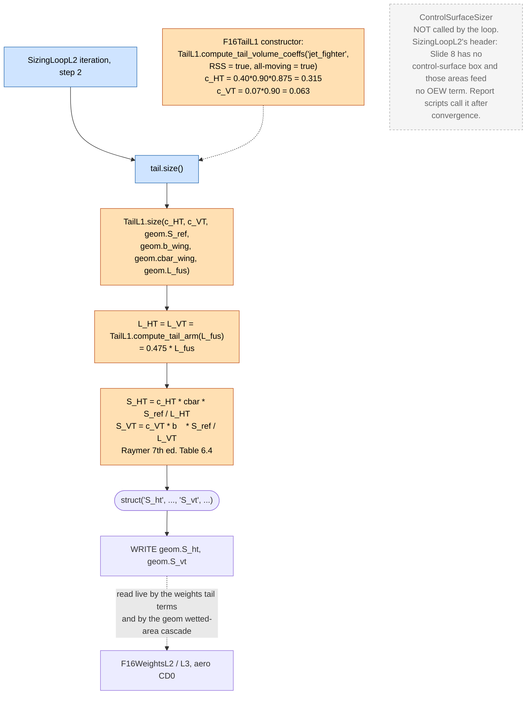
```mermaid
flowchart TD
    LOOP["SizingLoopL2 iteration, step 2"]
    LOOP --> T["tail.size()"]
    T --> TT["TailL1.size(c_HT, c_VT, geom.S_ref,<br/>geom.b_wing, geom.cbar_wing, geom.L_fus)"]
    TT --> ARM["L_HT = L_VT = TailL1.compute_tail_arm(L_fus)<br/>= 0.475 * L_fus"]
    ARM --> TC["S_HT = c_HT * cbar * S_ref / L_HT<br/>S_VT = c_VT * b    * S_ref / L_VT<br/>Raymer 7th ed. Table 6.4"]
    TC --> TR(["struct('S_ht', ..., 'S_vt', ...)"])
    TR --> TW["WRITE geom.S_ht, geom.S_vt"]
    TW -.->|"read live by the weights tail terms<br/>and by the geom wetted-area cascade"| DOWN["F16WeightsL2 / L3, aero CD0"]

    CTOR["F16TailL1 constructor:<br/>TailL1.compute_tail_volume_coeffs('jet_fighter',<br/>RSS = true, all-moving = true)<br/>c_HT = 0.40*0.90*0.875 = 0.315<br/>c_VT = 0.07*0.90 = 0.063"] -.-> T

    CTRL["ControlSurfaceSizer<br/>NOT called by the loop.<br/>SizingLoopL2's header: Slide 8 has no<br/>control-surface box and those areas feed<br/>no OEW term. Report scripts call it after<br/>convergence."]

    classDef orch fill:#cfe4ff,stroke:#2b6cb0,color:#000
    classDef tb fill:#ffe0b3,stroke:#c05621,color:#000
    classDef out fill:#f5f5f5,stroke:#aaa,color:#666,stroke-dasharray: 4 3
    class LOOP,T orch
    class TT,TC,ARM,CTOR tb
    class CTRL out
```

**Why the tail is sized before the weights call and not after.** The weights
class reads `geom.S_ht` and `geom.S_vt` live, so sizing the tail after step 5
would feed the previous iteration's tail into this iteration's empty weight.

**Feedback in the tail arm.** `geom.L_HT` and `geom.L_VT` are `Dependent` on
`x_c4_wing`, `x_c4_ht` and `x_c4_vt`, which move with both `S_ref` and
`S_ht`/`S_vt`. The arm is therefore part of the fixed point, lagged by one
iteration. The lag is stable: a larger `S_ht` lengthens the arm, which makes
the next `S_ht` smaller.

---

## 9. `wts.get_OEW(W_TO)`, expanded, all three levels

The method is `get_OEW`, and it takes `W_TO` as an argument at every level. The
loop passes the current iterate; it is not read off `obj.W_TO`. The loop writes
`wts.W_TO` **after** the call, for the reporting scripts and for the
`Dependent` weight-breakdown properties.

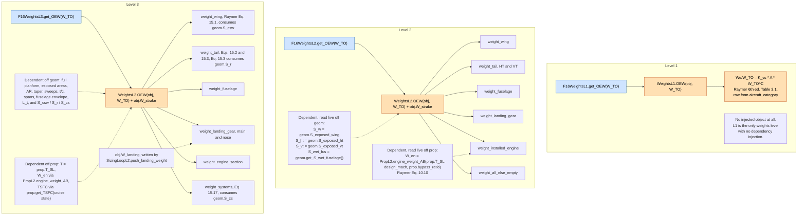
```mermaid
flowchart TD
    subgraph L1["Level 1"]
        O1["F16WeightsL1.get_OEW(W_TO)"]
        O1 --> W1["WeightsL1.OEW(obj, W_TO)"]
        W1 --> W1A["We/W_TO = K_vs * A * W_TO^C<br/>Raymer 6th ed. Table 3.1,<br/>row from aircraft_category"]
        NOTE1["No injected object at all.<br/>L1 is the only weights level<br/>with no dependency injection."]
    end

    subgraph L2["Level 2"]
        O2["F16WeightsL2.get_OEW(W_TO)"]
        O2 --> W2["WeightsL2.OEW(obj, W_TO) + obj.W_strake"]
        W2 --> W2A["weight_wing"]
        W2 --> W2B["weight_tail, HT and VT"]
        W2 --> W2C["weight_fuselage"]
        W2 --> W2D["weight_landing_gear"]
        W2 --> W2E["weight_installed_engine"]
        W2 --> W2F["weight_all_else_empty"]
        G2["Dependent, read live off geom:<br/>S_w = geom.S_exposed_wing<br/>S_ht = geom.S_exposed_ht<br/>S_vt = geom.S_exposed_vt<br/>S_wet_fus = geom.get_S_wet_fuselage()"] -.-> W2
        P2["Dependent, read live off prop:<br/>W_en = PropL2.engine_weight_AB(prop.T_SL,<br/>design_mach, prop.bypass_ratio)<br/>Raymer Eq. 10.10"] -.-> W2E
    end

    subgraph L3["Level 3"]
        O3["F16WeightsL3.get_OEW(W_TO)"]
        O3 --> W3["WeightsL3.OEW(obj, W_TO) + obj.W_strake"]
        W3 --> W3A["weight_wing, Raymer Eq. 15.1, consumes geom.S_csw"]
        W3 --> W3B["weight_tail, Eqs. 15.2 and 15.3, Eq. 15.3 consumes geom.S_r"]
        W3 --> W3C["weight_fuselage"]
        W3 --> W3D["weight_landing_gear, main and nose"]
        W3 --> W3E["weight_engine_section"]
        W3 --> W3F["weight_systems, Eq. 15.17, consumes geom.S_cs"]
        G3["Dependent off geom: full planform, exposed areas,<br/>AR, taper, sweeps, t/c, spans, fuselage envelope,<br/>L_t, and S_csw / S_r / S_cs"] -.-> W3
        P3["Dependent off prop: T = prop.T_SL,<br/>W_en via PropL2.engine_weight_AB,<br/>TSFC via prop.get_TSFC(cruise state)"] -.-> W3
        WL["obj.W_landing, written by<br/>SizingLoopL2.push_landing_weight"] -.-> W3D
    end

    classDef orch fill:#cfe4ff,stroke:#2b6cb0,color:#000
    classDef tb fill:#ffe0b3,stroke:#c05621,color:#000
    class O1,O2,O3 orch
    class W1,W2,W3,W1A tb
```

---

## 10. The geometry `Dependent` cascade

This is the mechanism behind most of the dotted edges above. Nothing is cached.
Every getter recomputes on read.

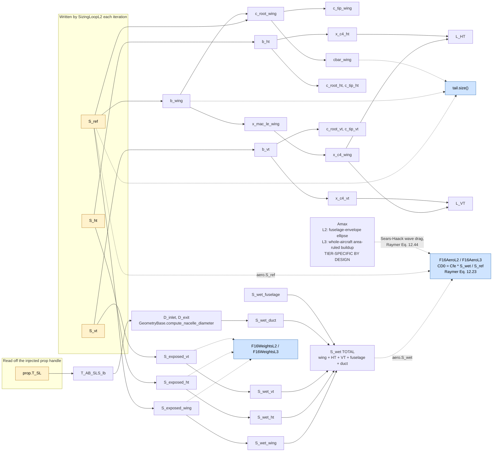
```mermaid
flowchart LR
    subgraph WRITTEN["Written by SizingLoopL2 each iteration"]
        SR["S_ref"]
        SHT["S_ht"]
        SVT["S_vt"]
    end

    subgraph EXTERNAL["Read off the injected prop handle"]
        PT["prop.T_SL"]
    end

    SR --> BW["b_wing"]
    SR --> CRW["c_root_wing"]
    BW --> CRW
    CRW --> CTW["c_tip_wing"]
    CRW --> CBW["cbar_wing"]
    SR --> SEW["S_exposed_wing"]
    SEW --> SWW["S_wet_wing"]
    BW --> XML["x_mac_le_wing"]
    XML --> XC4W["x_c4_wing"]

    SHT --> BHT["b_ht"]
    BHT --> CRHT["c_root_ht, c_tip_ht"]
    SHT --> SEHT["S_exposed_ht"]
    SEHT --> SWHT["S_wet_ht"]
    BHT --> XC4H["x_c4_ht"]

    SVT --> BVT["b_vt"]
    BVT --> CRVT["c_root_vt, c_tip_vt"]
    SVT --> SEVT["S_exposed_vt"]
    SEVT --> SWVT["S_wet_vt"]
    BVT --> XC4V["x_c4_vt"]

    PT --> TAB["T_AB_SLS_lb"]
    TAB --> DIN["D_inlet, D_exit<br/>GeometryBase.compute_nacelle_diameter"]
    DIN --> SWD["S_wet_duct"]

    SWW --> SWET["S_wet TOTAL<br/>wing + HT + VT + fuselage + duct"]
    SWHT --> SWET
    SWVT --> SWET
    SWD --> SWET
    FUS["S_wet_fuselage"] --> SWET

    XC4W --> LHT["L_HT"]
    XC4H --> LHT
    XC4W --> LVT["L_VT"]
    XC4V --> LVT

    AMAX["Amax<br/>L2: fuselage-envelope ellipse<br/>L3: whole-aircraft area-ruled buildup<br/>TIER-SPECIFIC BY DESIGN"]

    SWET -.->|"aero.S_wet"| AERO["F16AeroL2 / F16AeroL3<br/>CD0 = Cfe * S_wet / S_ref<br/>Raymer Eq. 12.23"]
    SR -.->|"aero.S_ref"| AERO
    AMAX -.->|"Sears-Haack wave drag,<br/>Raymer Eq. 12.44"| AERO

    SEW -.-> WTS["F16WeightsL2 / F16WeightsL3"]
    SEHT -.-> WTS
    SEVT -.-> WTS
    SR -.-> TAIL["tail.size()"]
    BW -.-> TAIL
    CBW -.-> TAIL

    classDef written fill:#fff2cc,stroke:#b7791f,color:#000
    classDef orch fill:#cfe4ff,stroke:#2b6cb0,color:#000
    class SR,SHT,SVT,PT written
    class AERO,WTS,TAIL orch
```

---

## 11. Class inheritance

The static toolboxes (`AeroL1`, `GeomL2`, `PropL2`, `WeightsL3`, `TailL1`,
`MissionEquations`, `SizingSteps`, ...) are **not** in any inheritance chain.
They appear above only as call targets.


```mermaid
classDiagram
    class SizingLoopL1 {
        <<handle>>
        +SizingLoopL1(aero, prop, wts, geom, miss, con)
        +run(W_TO_guess, opts) result
    }
    class SizingLoopL2 {
        <<handle>>
        +SizingLoopL2(aero, prop, wts, geom, miss, con, tail)
        +run(W_TO_guess, T_SL_guess, opts) result
    }
    class SizingSteps {
        <<static toolbox>>
        +togw_update(W_payload, W_OEW, W_fuel, W_TO)$ W0_new_and_denom
        +relax(x_old, x_new, w)$ x
    }

    class AerodynamicsBase {
        <<abstract handle>>
        +drag_polar(state)*
        +get_CLmax(state)*
    }
    class PropulsionBase {
        <<abstract handle>>
        +T_SL*
        +get_thrust_lapse(state, setting)*
        +get_TSFC(state)*
    }
    class WeightsBase {
        <<abstract handle>>
        +W_TO*
        +W_energy*
        +W_payload_fixed*
        +W_payload_expendable*
        +get_OEW(W_TO)*
    }
    class GeometryBase {
        <<abstract handle>>
        +S_ref*
        +get_S_ref()*
        +get_S_wet()*
    }
    class MissionAnalysisBase {
        <<abstract handle>>
        +total_fuel(W_TO) W_fuel_and_breakdown
        +build_context(W_TO)
    }
    class ConstraintAnalysis {
        <<value class>>
        +optimal_point() WS_and_TW
        +optimal_point_continuous(x0) WS_TW_info
        +envelope() TW_envelope
        +from_requirements(aero, prop, path, map, WS_range)$
    }
    class TailSizingBase {
        <<abstract handle>>
        +size()*
    }
    class ControlSurfaceSizer {
        <<handle, NOT in either loop>>
        +size(geom) result
    }
    class PointPerformanceBase {
        <<abstract handle>>
        +name
        +constraint_residual(dp)*
    }

    AerodynamicsBase <|-- AeroModelL1
    AerodynamicsBase <|-- AeroModelL2
    AerodynamicsBase <|-- AeroModelL3
    AeroModelL1 <|-- F16AeroL1
    AeroModelL2 <|-- F16AeroL2
    AeroModelL3 <|-- F16AeroL3

    PropulsionBase <|-- PropulsionModelL1
    PropulsionBase <|-- PropulsionModelL2
    PropulsionModelL1 <|-- F16PropL1
    PropulsionModelL2 <|-- F16PropL2

    WeightsBase <|-- WeightsModelL1
    WeightsBase <|-- WeightsModelL2
    WeightsBase <|-- WeightsModelL3
    WeightsModelL1 <|-- F16WeightsL1
    WeightsModelL2 <|-- F16WeightsL2
    WeightsModelL3 <|-- F16WeightsL3

    GeometryBase <|-- GeometryModelL1
    GeometryBase <|-- GeometryModelL2
    GeometryBase <|-- GeometryModelL3
    GeometryModelL1 <|-- F16GeomL1
    GeometryModelL2 <|-- F16GeomL2
    GeometryModelL3 <|-- F16GeomL3

    MissionAnalysisBase <|-- MissionAnalysisL1
    MissionAnalysisBase <|-- MissionAnalysisL2

    TailSizingBase <|-- TailSizingModelL1
    TailSizingModelL1 <|-- F16TailL1

    PointPerformanceBase <|-- Both_WbyS_TbyW
    PointPerformanceBase <|-- Only_WbyS
    PointPerformanceBase <|-- Only_TbyW
    Both_WbyS_TbyW <|-- MasterEquationConstraint
    Both_WbyS_TbyW <|-- TakeoffConstraint
    MasterEquationConstraint <|-- LevelFlightConstraint
    MasterEquationConstraint <|-- SustainedTurnConstraint
    MasterEquationConstraint <|-- ExcessPowerConstraint
    Only_WbyS <|-- LandingConstraint
    Only_WbyS <|-- StallConstraint

    SizingLoopL1 o-- AerodynamicsBase
    SizingLoopL1 o-- PropulsionBase
    SizingLoopL1 o-- WeightsBase
    SizingLoopL1 o-- GeometryBase
    SizingLoopL1 o-- MissionAnalysisBase
    SizingLoopL1 o-- ConstraintAnalysis

    SizingLoopL2 o-- AerodynamicsBase
    SizingLoopL2 o-- PropulsionBase
    SizingLoopL2 o-- WeightsBase
    SizingLoopL2 o-- GeometryBase
    SizingLoopL2 o-- MissionAnalysisBase
    SizingLoopL2 o-- ConstraintAnalysis
    SizingLoopL2 o-- TailSizingBase

    SizingLoopL1 ..> SizingSteps
    SizingLoopL2 ..> SizingSteps
    ConstraintAnalysis o-- PointPerformanceBase
```

---

## 12. Difference summary, L1 against L2 and L3

| Item | `SizingLoopL1` | `SizingLoopL2`, used by L2 and L3 |
| --- | --- | --- |
| Injected objects | 6 | **7**, adds `tail` |
| `run` signature | `run(W_TO_guess, opts)` | `run(W_TO_guess, T_SL_guess, opts)` |
| State variables | `W_TO` | `W_TO` **and** `T_SL` |
| Relaxation options | `opts.relaxation` | `opts.relax_W`, `opts.relax_T` |
| `optimal_point_continuous()` | ONE time, before the loop; not re-solved post-loop either | EVERY iteration, warm-started, plus once more post-loop |
| Why | L1 aero holds no geometry, so the envelope cannot move | `geom.S_ref` and `prop.T_SL` both move `S_wet`, so `CD0`, so every curve |
| `S_ref` | Solved, `W_TO / WS` | Solved, `W_TO / WS` |
| `prop.T_SL` inside the loop | Write-only, no reader | Read by `geom.T_AB_SLS_lb`, by the weights engine term, and by the takeoff, climb and combat segments |
| `geom.W_TO` write | present, guarded by `isprop` | absent |
| Tail | Not sized | `tail.size()` every iteration, before the weights call |
| Control surfaces | Never | **Never.** Report scripts size them after convergence |
| Mission breakdown | Discarded | Consumed, `push_landing_weight` -> `wts.W_landing` (L3 only) |
| Convergence test | `abs(W0_new-W0)/W0_new < tol_rel` | The same **AND** the same test on `T_SL` |
| Closure | `SizingSteps.togw_update`, Raymer Eq. 3.4 | The same |
| On infeasible closure | `error`, no fallback equation | `error`, no fallback equation |
| Extra error id | -- | `SizingLoopL2:badThrust` |
| `history` fields | 6 | 13 |
| `result` fields | 10 | 12 |
| Citation | Martins slide 6 | Martins slide 8 |

---

## 13. Source files

| Diagram | Primary source |
| --- | --- |
| 1, 2 | `src/sizing/SizingLoopL1.m`, `src/sizing/SizingSteps.m`, `examples/F16A/models/sizing/f16_sizing_L1.m` |
| 3, 4, 4b | `src/sizing/SizingLoopL2.m`, `examples/F16A/models/sizing/f16_sizing_L2.m`, `f16_sizing_L3.m` |
| 5 | `src/constraints/*.m`, `examples/F16A/models/sizing/F16ConstraintSet.m`, `examples/F16A/inputs/f16a_requirements.json` |
| 6, 7 | `src/core/mission/**`, `examples/F16A/inputs/f16a_requirements.json` CAP profile |
| 8 | `src/disciplines/tail_sizing/TailL1.m`, `examples/F16A/models/disciplines/tail/F16TailL1.m`, `src/sizing/ControlSurfaceSizer.m` |
| 9 | `src/disciplines/weights/WeightsL*.m`, `examples/F16A/models/disciplines/weights/F16WeightsL*.m` |
| 10 | `examples/F16A/models/disciplines/geom/F16GeomL2.m`, `F16GeomL3.m`, `src/disciplines/geometry/GeomL2.m`, `GeomL3.m` |
| 11 | `src/base/*.m`, the full `src/` and `examples/F16A/` trees |

---

## 14. Errata against the 2026-08-13 version

Kept so that anyone working from the old version can see what moved. Every row
was checked against the source on 2026-09-20.

| The old file said | The source says |
| --- | --- |
| `W_TO = relaxation*W_TO + (1-relaxation)*W_TO_new` | `SizingSteps.relax` weights the **NEW** value: `x_old + w*(x_new - x_old)`. The old form is the opposite convention. |
| `MIN_DENOM = 0.05`, with a Nicolai Eq. 5.1 fallback when the denominator is small | Neither exists. `togw_update` returns `NaN` when `denom <= 0`, and both loops `error`. There is no fallback equation anywhere in `src/sizing/`. |
| `ctrl.size(geom)` runs inside the L2 loop | It does not. `SizingLoopL2`'s header says so explicitly. Report scripts call `ControlSurfaceSizer` after convergence. |
| `SizingLoopL2` takes 8 injected objects | 7: `aero, prop, wts, geom, miss, con, tail`. |
| The loops call `con.optimal_point()` | Both call `con.optimal_point_continuous()`. The grid method is the seed and the toolbox-free test reference. |
| L2 `history` has 15 fields | 13. |
| `miss.compute_fuel(aero, prop, W_TO)` and `wts.OEW(W_TO)` | `miss.total_fuel(W_TO)` and `wts.get_OEW(W_TO)`. |
| `tail.size(S_ref, b, cbar, L_HT, L_VT)` | `tail.size()` takes no arguments; it reads the injected geometry live. |
| L2 order is `S_ref` then `T_SL` then `tail` | `S_ref` -> `tail` -> `prop.T_SL` -> **then** the constraint solve. |
| L1 post-loop re-derives the design point | It does not. L2 does. |
| Sources are `design_study_01_L1.m`, `_02_L2.m`, `_03_L3.m` | Those were retired. The drivers are `examples/F16A/models/sizing/f16_sizing_L{1,2,3}.m`. |

A teaching treatment of the same two loops, with worked numbers, is in
`sizing/teaching/` — see `AOE4065_Sizing/guide/Sizing_Guide.pdf`.
